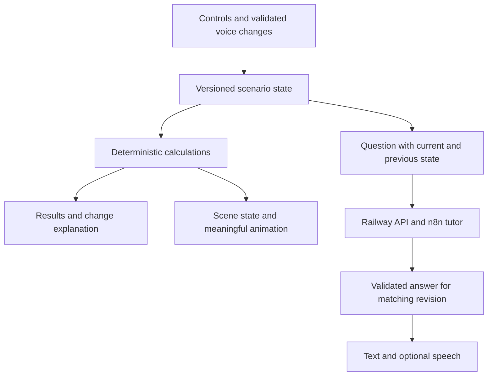

# Flow4Gold Addendum 02 — clear lessons, believable animation, and purposeful interaction

Project: **The Economics of Everything**  
Prepared: September 29, 2026, America/New_York  
Live site reviewed: https://web-production-af12a.up.railway.app/  
Status: **Live-site review and implementation specification. No application code was changed or deployed during this review.**

Read with `Flow4Gold_Build_Brief.md` and `Flow4Gold_Addendum_01.md`. This addendum overrides conflicting presentation, interaction, and visual requirements in those documents. Preserve the existing working application, all three lessons, Railway deployment, public URL/QR entry, deterministic calculations, and optional text/voice exploration. Blender is already installed.

## 1. What Alicia is asking for

The application is developing well, but its interface currently expects the learner to understand the model before the lesson teaches it. Turn each lesson into an understandable story: **what is happening, what can I change, what changed because of my choice, and why does that matter?**

Alicia wants recognizable people with believable proportions, clothing and movement; a performing DJ and concert crowd; speakers, attendees and distinct conference spaces; and recognizable cars, workers, machinery and a moving assembly line. She is not requiring photorealism or separate 2D and 3D modes. One polished animated experience is acceptable. Keep functioning 3D where useful, but do not make switching rendering modes the learner's task. A prerecorded movie alone still cannot replace the live simulation.

The target is a welcoming learning experience, not an exposed parameter editor. Keep the useful mathematics; make its meaning visible.

## 2. Evidence from the live review

The original brief and Addendum 01 were read before preparing this specification. The public desktop website was inspected through its rendered interface. No repository, server logs, Railway configuration, n8n workflow, or Blender source was available for inspection. Observations below establish visible behavior, not underlying implementation causes.

| Area | What was observed | Implication |
| --- | --- | --- |
| Navigation | Concert, conference and factory lesson links opened their respective pages. | Preserve working lesson routes and navigation. This is not an assertion that every link works. |
| Concert wording | “Audience interest at price 20,” “Venue cost per available place,” “Cost per attendee,” and “Price sensitivity” appear without sufficient nearby explanation. | Rewrite labels and add short, numerical examples beside the relevant controls. |
| Concert arithmetic | Default price 20: 150 guests, revenue 3,000, cost 2,250, profit 750. Changing price to 30 produced 100 guests, revenue 3,000, cost 2,000, profit 1,000. | The checked case is internally consistent; explain the mechanism instead of simply announcing updated results. |
| Conference | Increasing workshop seats from 200 to 300, with 500 attendees, raised costs from 25,000 to 26,000, reduced surplus from 5,000 to 4,000, and raised workshop access from 40% to 60%. | Show “100 more people can join; setup costs 1,000 more.” Percentages alone are harder to interpret. |
| Conference funding | After that change, the page showed a 1,000 funding budget gap while still showing a 4,000 surplus. | Explain that a spending limit and the event's eventual financial result answer different questions. This is not necessarily a calculation defect. |
| Factory | Default day 1 produced 100 cars and left 50 parts. Day 2 produced 50 and left zero. Day 3 produced zero and displayed a stopped-line message. | The inventory sequence checked out. Make it the central visible story, with a delivery timeline and explicit day labels. Day 4 was not advanced during this review. |
| Factory copied text | The preset helper says “Capacity alone never creates demand,” including on the factory page. | Replace generic copied helper text with lesson-specific guidance. |
| Factory explanation | A supplier explanation describes an alternative order delivering zero parts. | If no backup order exists, say “No backup delivery is scheduled.” Do not narrate a nonexistent shipment. |
| Scene controls | Selecting Audience & demand, Workshops, and Supplier & deliveries changed contextual text. The user reports camera movement without an obvious learning purpose in the 3D experience. | Retain working explanations, but add a clear selected object, focus label, consequence and optional experiment. Do not describe every hotspot as broken. |
| Rendering | All three pages reported “3D is unavailable” in this review browser. Concert/conference fallbacks used very simple figures and similar stage layouts; factory fallback used car symbols. | Diagnose 3D availability in the actual project. This review cannot establish whether the cause is device capability, assets, or code. Upgrade fallback art as well. |
| Story | The factory story opened with a video surface, visible captioned content and an expandable transcript. The observed framing included a recording of the app's scene and dense metrics. | Keep the story entry point and transcript. Improve storytelling composition and character detail; avoid reproducing the entire dashboard inside a small video. Full playback, audio and voice identity were not evaluated. |
| Voice area | A question field, Speak a question, Ask question, Speak replies, Replay answer, Stop audio and Audition voice are exposed together. | Consolidate the learner controls. Put creator voice audition in a development/review surface. Microphone/transcription and spoken answers were not tested. |

Real-device mobile performance, the user's working QR flow, both languages, all arrows, service integrations and complete video playback remain verification tasks. The user reports that mobile and QR entry work well; preserve them.

## 3. Make the page teach in a clear order

Recommended order:

1. **A question and a two-sentence setup.** Tell the learner what situation they are looking at.
2. **A recognizable animated world.** Include one visible focal point and a short status sentence.
3. **Two or three beginner decisions.** Each has a plain label, a unit, one line of help and an immediately visible consequence.
4. **A compact result strip.** Use three or four key outcomes; put the detailed breakdown behind an explicit link.
5. **A “What changed?” explanation.** Describe the causal chain using the actual before/after values.
6. **Optional depth.** Explore zones, watch the short story, ask a question, inspect additional assumptions or compare scenarios.

Suggested section labels: “Try a change,” “What happened,” “Explore the scene,” and “More details.” Replace “Advanced cost assumptions” with “Change costs and assumptions,” while retaining a collapsible advanced area. Do not hide information essential to understanding the current outcome.

Keep the existing cream, teal and warm accent identity where it works. Improve hierarchy and space use; large nearly empty scene panels and long stacks of equally prominent controls weaken the learning sequence. On phones, keep the scene, primary controls and result summary close together. Do not replace the working mobile layout wholesale.

Use a single declared money convention everywhere. Prefer a visible “Fictional example · amounts in currency units” note and a short unit such as CU beside monetary inputs. Do not add a dollar symbol unless a specific currency is chosen consistently. Every field must distinguish people, seats, cars, parts, days, money per item, and total money. Every factory output must identify whether it is **today** or **so far**.

## 4. Concert: clear choices and explanations

Opening setup: “You are planning a live music event. Ticket sales bring money in; the venue, production and guests create costs. Try a different ticket price and see how attendance and profit change in this fictional example.”

Keep ticket price and venue size prominent. Put audience-demand assumptions in an optional “Change audience assumptions” area, with a clear explanation of the initial audience assumption visible nearby. Capacity remains editable beyond 200, including existing larger presets and custom input. A bigger venue never automatically creates customers.

| Current term | Proposed label | Help or worked example |
| --- | --- | --- |
| Ticket price | Ticket price per person | “How much one guest pays to enter.” Show the money unit. |
| Venue capacity | How many people the venue can hold | “The maximum number of guests. Empty spaces earn no ticket money.” |
| Audience interest at price 20 | People willing to buy a ticket at 20 CU | “Our starting assumption is 150 people at this reference price. The model adjusts that number when your ticket price changes.” The 20 is the fixed reference price, not the current price. |
| Production budget | Stage, DJ and production costs | “A fixed 1,000 CU in this example, even if fewer guests attend.” List included costs so venue hire is not counted twice. |
| Venue cost per available place | Venue hire rate per person of capacity | “At 2.50 CU per place, a 200-person venue costs 500 CU even if only 150 attend.” Present total venue hire prominently; the rate belongs in assumptions. |
| Cost per attendee | Extra cost for each guest who attends | “For example, guest supplies or services: 5 CU × 150 guests = 750 CU.” These are illustrative inclusions, not claims about a particular event. |
| Price sensitivity | How strongly ticket price affects demand | Use Low / Medium / High with defined model values, plus an optional numeric parameter. Keep the exact formula available. |
| Potential demand | People who would buy at this price | “Before the venue's capacity limit.” |
| Guests | Expected guests | “The smaller of ticket demand and venue capacity.” |
| Unmet demand | People who want tickets but cannot fit | “Potential ticket buyers beyond the venue limit.” |
| Occupancy | How full the venue is | “150 of 200 places filled — 75%.” |
| Projected revenue | Ticket money coming in | “Ticket price × expected guests.” |
| Total cost | Total event costs | Open a breakdown into production, venue hire and guest-related costs. |
| Event profit / loss | Profit after event costs | Show “Loss” explicitly when negative, without relying only on color. |
| Return on cost | Profit compared with costs | Keep in details; explain the denominator and zero-cost case. |

For the existing model, preserve `D = floor(M × (p / 20)^(-e))` and `attendance = min(capacity, D)` unless a separate model correction is justified. Suggested sensitivity presets: Low = 0.5, Medium = 1, High = 2; retain validated numeric settings in details. These are teaching assumptions, not measured estimates. At e=1, doubling price halves unconstrained demand before rounding. This does not mean “one fewer attendee per currency unit.” At e=0, demand does not respond to price in the model.

Required explanation for the verified price experiment: “You raised the ticket price from 20 to 30 CU. Expected attendance fell from 150 to 100. Ticket revenue stayed at 3,000 CU, but serving fewer guests reduced costs by 250 CU, so profit rose from 750 to 1,000 CU.” Show the crowd change and cost breakdown together.

Required capacity-only experiment: at the default assumptions, increase capacity from 200 to 1,000 without changing demand. Attendance stays at 150; revenue stays at 3,000; costs become 4,250; result becomes a loss of 1,250. Explain that the extra capacity increased venue hire without adding buyers. A named preset can change several assumptions, but must summarize them visibly.

## 5. Conference: show what attendees gain and what it costs

Opening setup: “You have 500 people coming to a conference. They need room to learn, meet and eat. Try adding workshop places and see how access and the event budget change.” Use actual scenario values dynamically.

Beginner controls: expected attendees, ticket price and workshop places. Venue size and sponsorship remain easy to reach in a “Venue and funding” group; expose catering and the remaining assumptions in sensible groups. Preserve all existing editable values.

| Current term | Proposed label | Help or worked example |
| --- | --- | --- |
| Expected attendees | People expected to attend | “Your attendance assumption. In this lesson, changing price does not automatically change it.” |
| Venue capacity | Maximum people the venue can hold | “Attendance cannot exceed this number.” |
| Sponsor contribution | Money provided by sponsors | “Added to ticket income; this does not measure the sponsor's return.” |
| Workshop seats | People who can join a workshop at one time | “200 places for 500 attendees means 40% can join in this simplified allocation.” Do not imply that all remaining attendees actually want a workshop. |
| Networking-area seats | Seats available in the networking area | “How many attendees can be seated there at once; it does not measure networking quality.” |
| Catering per person | Food and drink budget per attendee | “15 CU × 500 attendees = 7,500 CU.” |
| Speaker budget | Total speaker costs | “The total allowance for speakers in this example.” |
| Venue cost | Total venue hire cost | “A fixed amount for this scenario. Changing capacity alone currently does not automatically recalculate it unless the implemented model says otherwise.” |
| Cost per workshop seat | Setup cost for each workshop place | “Illustrative equipment/materials allowance: 10 CU × 200 places = 2,000 CU.” Do not imply this is only a chair purchase. |
| Cost per networking seat | Setup cost for each networking seat | “100 seats at 10 CU each cost 1,000 CU in this model.” |
| Other fixed costs | Other event costs | Identify included expenses and avoid duplication. |
| Funding budget | Planned spending limit | “The amount you have set aside for costs. This does not add money to ticket or sponsor income.” If the code uses a different meaning, reconcile it before renaming. |
| Funding budget gap | Amount above your spending limit | “Costs of 26,000 CU are 1,000 CU above a 25,000 CU limit, even though expected income is 30,000 CU.” This is not automatically a cash-flow forecast. |
| Surplus / deficit | Money left after event costs | “Total ticket and sponsor income minus all modeled event costs.” Show “Shortfall” when negative. |
| Workshop access % | Workshop places available | Lead with “300 of 500 people — 60%.” |
| Networking capacity % | Networking seats available | Lead with “100 seats for 500 people — 20%.” |

Primary results: attendees, total income, total costs, money left. Beside the workshop scene show places available as a count and percentage.

Required experiment: add 100 workshop places. Highlight the workshop area, add visible places, show access rising from 200/500 to 300/500, and show costs rising by 1,000 CU with money left falling by 1,000 CU. If a queue is drawn, either model workshop demand explicitly or label it as a representation of limited access; do not invent a literal 300-person queue from the access percentage.

Do not claim attendee satisfaction or learning outcomes from seating capacity. Do not present sponsor income as sponsor ROI.

## 6. Factory: let the learner follow one missing part

Opening setup: “This factory aims to build 100 cars a day. Each car needs one of these small parts. You start with 150 parts, and the next delivery arrives on day 4. Step through the days to see what happens.” Use current values and distinguish the modeled component from the many other components in a real car.

Primary choices: cars to build per day, parts available at the start, and next delivery timing. Show delivery quantity beside the timeline; put backup ordering in an understandable optional section, separate from financial assumptions.

| Current term | Proposed label | Help or worked example |
| --- | --- | --- |
| Daily production target | Cars we aim to build each day | “The goal; available parts may prevent us reaching it.” |
| Opening component stock | Parts available before day 1 | “One of these parts is needed for each car.” |
| Supplier delay (days) | Days before the next delivery | Show the calculated “Arrives before production on day 4.” Preserve the current delay-to-arrival convention; do not create an off-by-one error. |
| Planned delivery quantity | Parts in the next delivery | “How many parts the main supplier will bring.” |
| Vehicle selling price | Selling price of one finished car | Show money per car. |
| Other cost per vehicle | Other production cost per car | “The modeled car cost excluding this component.” |
| Component purchase cost | Price of one standard part | “10 CU per part in this example.” |
| Alternative order quantity | Parts ordered from a backup supplier | “Zero means no backup order.” |
| Alternative arrival day | Day the backup parts arrive | “Received before that day's production.” |
| Premium per alternative part | Extra price for each backup part | “Standard price 10 CU + extra 5 CU = 15 CU per backup part.” |
| Daily carrying cost per part | Daily storage cost for each unused part | “Charged on parts left at the end of the day.” |
| Daily operating cost | Cost to keep the factory open each day | “Still charged when the line cannot produce, if that is the configured model.” |
| Daily sales if not automatic | Cars customers buy each day | Use only when automatic sale of all completed cars is off; explain production and sales separately. |
| Component inventory | Parts left in stock | Distinguish starting parts, arrivals, used parts and ending parts. |
| Cumulative production | Cars built so far | Distinguish from “Cars built today.” |
| Unfilled production opportunities | Cars not built against the plan | “Planned production minus actual production so far. This is not automatically lost sales or a customer backlog.” |
| Finished inventory | Completed cars waiting to be sold | Relevant when production and sales differ. |
| Consumed component cost | Cost of standard parts used | Keep in the breakdown; explain inventory accounting before interpreting it as cash paid. |
| Consumed supplier premiums | Extra backup-part cost used | Avoid double-counting this in total part cost. |
| Cash for arriving orders | Cash paid for delivered parts | Separate from cost of parts used; these amounts can differ. |
| Inventory carrying costs | Storage costs so far | Show the daily rate and accumulated total. |
| Operating contribution | Sales money left after modeled costs | “Sales revenue minus the cost of cars sold, part storage and daily operating costs. This excludes costs outside the model and is not the company's net profit.” Verify against the actual calculation before changing the label. |

The factory already explains operating contribution in its model section. Move a shorter version beside the metric and provide a clear breakdown on demand. On the reviewed default day 1: sales 3,000,000 minus other vehicle costs 2,400,000, parts used 1,000, storage 5 and operating cost 1,000 = 597,995. This is a reference example, not a forecast.

Show a Day 1 / Day 2 / Day 3 / Day 4 timeline with deliveries marked. Explain the next step before advancing. “Run days” becomes “Play the days,” with an explicit Pause simulation control. Decorative “Pause motion” must not silently mean the same thing as stopping simulated time. If these functions are merged, define and test the shared behavior.

Required operational sequence: day 1 builds 100 and leaves 50 parts; day 2 builds 50 and leaves zero; day 3 builds zero; day 4 receives 200, builds 100 and leaves 100. Total cars built by day 4: 250 against a 400-car plan. Show deliveries before production. Do not change the counter until the corresponding simulated event is committed.

If the learner edits a starting assumption after advancing time, label the action “Restart with these settings,” or clearly explain an existing deterministic recomputation. Do not silently combine a new starting state with old history.

## 7. Turn scene navigation into meaningful exploration

Separate **looking** from **changing**. A view selection does not itself change costs or production; an experiment does. Use controls appropriate to those meanings.

Every selected zone must provide:

1. A persistent selected state and heading, e.g. “Looking at: the parts delivery.”
2. A visible outline, spotlight or callout on the relevant object. Camera movement is optional supporting behavior.
3. One sentence describing what is happening using current numbers.
4. One sentence explaining why it matters.
5. A clearly named optional experiment, with its change previewed and reset/undo available.

| Lesson and zone | Show and explain | Optional experiment |
| --- | --- | --- |
| Concert: ticket entrance | Tickets sold × price, with people entering | “Try a higher ticket price” with exact proposed price |
| Concert: stage | DJ, equipment and production costs | “Increase the production budget” |
| Concert: audience | Occupied versus empty places and current demand | “Try a bigger venue” while holding demand fixed |
| Conference: registration | Ticket and sponsor income separately | “Change the ticket price” |
| Conference: workshops | Places available relative to attendance | “Add 100 workshop places” |
| Conference: networking/catering | Available seats or per-person provision and cost | “Add 50 networking seats” / “Add 5 CU per person for food” |
| Factory: supplier | Delivery truck, arrival day and quantity | “Try a backup delivery” with quantity, price and arrival day shown |
| Factory: stock | Bin fills/depletes as parts arrive/get used | “Start with 100 extra parts” |
| Factory: assembly | Car waiting at the exact missing-part station | “Advance one day” |
| Factory: completed cars | Built, sold and unsold cars distinguished | “Compare production and sales” |

Do not auto-apply the experiment merely because a learner selects a zone. In fallback mode, select the corresponding illustration, highlight the correct region and show the same explanation. Replace unusable drag/3D instructions with instructions appropriate to the active renderer. Use radio/tab/button semantics for mutually exclusive exploration choices; checkboxes should not imply independent toggles if only one zone can be selected.

Comparison controls should say “Save this version” and “Compare with saved version.” Label A/B values and differences in ordinary language. Explain whether reset affects only camera, settings, saved comparison or simulation time.

## 8. Believable animation and distinct environments

Aim for polished, approachable realism: identifiable anatomy, faces visible at useful close-up scale, varied hair/clothing/skin tones, believable proportions, clear materials, natural movement and coherent lighting. Avoid rows of nearly identical pegs, emoji cars, sliding rigid bodies, floating objects, or a generic concert stage reused as the conference environment. Realism does not require rendering every one of 20,000 attendees.

| Scene | Required art and motion | Meaningful response |
| --- | --- | --- |
| Concert | DJ behind a recognizable deck, hands operating controls, subtle head/body movement; people entering, dancing or talking; stage lights and speakers | Crowd density reflects expected attendance; venue layout reflects scale; selected cost area becomes visually legible |
| Conference | Speaker gesturing at a screen, seated listeners, workshop tables/materials, small groups meeting, registration and catering | Workshop allocation and financial trade-offs update together; zones have distinct identities |
| Factory | Recognizable vehicle bodies, wheels/windows, workers in appropriate workwear, component bins, conveyor and supplier truck | Delivery replenishes the bin; parts move into production; a shortage stops the affected station; arrival allows restart |

Use representative groups and state that briefly. Do not let group animation contradict exact numbers or suggest that raising capacity creates attendance. Workers should not continue completing cars when the model says zero production; ambient motion can continue without implying output.

Use the existing Blender and browser asset pipeline where suitable. Preserve editable source assets and export reproducibly. Inspect the installed Blender version and existing renderer before choosing export options. Verify animation, materials and lighting in the deployed browser; appearance in Blender alone is insufficient. Asset licenses must allow the intended use. Record sources and attribution requirements in an asset manifest.

Build one complete concert scene as the quality reference, then carry its character/material quality into the other two distinct environments. This is implementation order, not permission to omit conference or factory. If heavy 3D is unsuitable, a carefully authored animated 2D presentation can satisfy Alicia's updated preference when it retains live state-driven interaction. Keep a high-quality reduced-motion representation as well.

Do not add a mandatory Blender upgrade, source build, render farm or hosting migration to accomplish a visual polish pass. The supplied Blender repositories are references; cloning Blender itself does not generate finished characters or scenes.

### Concrete direction from the references inspected on retry

The Blender Studio motion-graphics article and embedded samples, Training page, Rain character page, Studio tools introduction, and Blender 5.2 LTS release page opened successfully in the browser after the initial documentation retrieval failures.

- The motion-graphics sample shows layered, colorful paper-like forms with depth, shadow and deliberate composition. Translate that care into material separation and directed attention; do not add abstract spirals to the lesson merely to resemble the reference. The article's title effects are not a ready-made concert or character pack.
- The Training page's facial-rigging example and Rain character artwork show defined eyes, brows, mouth, shaped hair and expressive posing. These are useful quality references for recognizable people. Use adult characters suited to the DJ, conference and factory roles; do not copy a childlike character style automatically.
- Rain is a concrete asset candidate to evaluate, not an approved drop-in browser asset. Its page lists a downloadable character, a Blender version requirement, and CC-BY attribution. Check the exact downloaded version, license, rig dependencies, exported animation and mobile cost before adoption. Its production rig may need animation baking and a simpler export; preserve the expressive result. No asset was downloaded or installed in this review.
- The release page shows further material, lighting and animation capabilities. Installing a release or naming a renderer does not produce this quality by itself. The work is in asset selection/modeling, rigging, motion, materials, lighting, composition and testing.

Blender-rendered films and the interactive browser scene are separate delivery surfaces. Build high-quality films with an appropriate Blender render workflow; build the browser version from optimized compatible assets and deliberate browser lighting. Do not promise that a Blender production render will transfer unchanged to Babylon.js.

Required visual review package from Codex: one close-up of a finished representative character, one full scene showing purposeful activity, and a 10–15 second recording of an actual input change with its visual consequence. Capture the browser output on desktop and phone. Use this as a quality checkpoint, then continue the other scenes to the same standard. If the result is still pegs, emoji, rigid sliding figures or only a camera orbit, the visual work is unfinished.

## 9. Short stories: show the mechanism rather than recite the dashboard

Keep “Watch the short story.” Use a purposeful 45–75 second sequence with a question, setup, visible problem, one change and a takeaway. Use the same world/characters as the interactive lesson. Frame the action closely enough for a phone; keep dense tables out of the movie. Captions must be legible without obscuring the important action.

| Story | Suggested visual sequence |
| --- | --- |
| Concert | DJ and arrivals → price tag 20 and 150 guests → price changes to 30 and crowd reduces to 100 → revenue stays 3,000 → guest costs fall and profit rises by 250 → invite learner to try venue size |
| Conference | 500 attendees arrive → 200 workshop places highlighted → add 100 places → access rises to 300/500 → costs rise by 1,000 and surplus falls by 1,000 → explain the experience/budget trade-off |
| Factory | Follow one small part into a car → day 1 stock falls from 150 to 50 → day 2 empties the bin → day 3 car waits at blocked station → day 4 truck arrives with 200 parts and production restarts → invite a backup-supplier comparison |

Keep fixed-video examples explicitly separate from current live settings. Preserve captions, transcript, replay and sound controls. Video selection alone must not reset the learner's simulation. Retain warm female Caribbean narration with natural cadence and clear delivery. The accent preference is not permission to clone Alicia's voice. Do not declare the preferred voice achieved without an audition and user review.

## 10. Voice: one obvious microphone, one coherent conversation

Replace the crowded learner panel with a question field, a recognizable microphone icon and a send button. A small label such as “Ask about this” can orient first-time users. Keep accessible names even if visible wording is minimal. Use comfortable touch targets and keyboard operation; do not rely on icon shape or color alone.

Microphone states: ready → listening (visible indicator, stop/cancel) → processing → answer → ready. Show the recognized transcript; allow corrections. Stop existing narration before recording so the tutor does not transcribe itself. Release the microphone on stop/cancel/navigation. Request microphone permission only following the user's explicit action.

Keep the answer text visible; expose play/stop on the answer and a compact sound preference. Show replay only where it is useful. Move “Audition voice” out of the public learning flow into creator review/settings. Provide typing when voice is unavailable, permission is denied, or the recording contains no speech. Do not show a disconnected icon as functioning voice.

Questions must use the active lesson, current scenario and relevant prior scenario. “Why did profit change?” requires both before and after values; current values alone cannot explain a difference. If there is no earlier state, say so and explain the current result. Allow validated spoken input changes with visible feedback and undo; clarify ambiguous numbers or units. Do not let the model invent economics or directly run code.

## 11. Architecture: keep one state driving all surfaces

Preserve Railway, the existing framework, Blender assets, browser renderer and n8n integration. This is an extension of the current app, not a replacement scaffold.



Implement a shared field/content dictionary containing stable input ID, localized label, unit, short help, worked example, beginner/advanced placement and validation. Do not rename internal keys blindly when changing visible wording. Inspect existing paths and use the project structure already present.

Add or extend these concepts where missing:

- `scenarioRevision`, `previousScenario`, `currentScenario` and `changedFields` for deterministic comparisons.
- `selectedZone` distinct from scenario-changing actions and simulation time.
- A derived `sceneState` for counts, activity, shortages, delivery events and selected highlights.
- Deterministic “What changed?” templates for common experiments; AI can elaborate when asked.
- Lesson-specific units and time scopes, including `today` and `cumulative` factory results.
- Localized label/help/narration content using the existing language structure.
- A versioned media/asset manifest and a fallback renderer driven by the same derived state.

Compute immediate feedback locally. Send question context to the existing backend/n8n flow, validate results there, and discard responses for an old lesson or scenario revision. Tie audio playback and caches to the same revision. Do not make model calls for every slider movement or animation frame. Keep secrets server-side and browser media permissions user-initiated.

For the 3D-unavailable report, inspect the actual initialization error, asset requests, import paths and device support in the repository/deployment. Do not infer a cause from this remote browser alone. Show a friendly lightweight-view state to the learner; keep technical diagnostics in developer logs. Do not present broken 3D controls as usable in fallback mode.

## 12. Implementation order and acceptance checks

1. Read the current repository instructions and inspect the existing app, formulas, assets and routes. Preserve uncommitted work and create a reversible checkpoint.
2. Implement labels, units, help, primary/advanced grouping, lesson-specific helper text and deterministic before/after explanations.
3. Separate scene focus from scenario experiments; add highlighted targets, useful action labels and state feedback. Simplify the voice panel without removing working capabilities.
4. Diagnose 3D availability. Build the concert visual quality reference and improve fallbacks; apply the quality standard to the distinct conference and factory scenes.
5. Reframe the three short stories and verify actual captioned playback. Preserve the voice preference and user-controlled sound.
6. Run focused calculation and interaction checks, then verify the deployed Railway result according to existing project deployment authorization. Document remaining gaps precisely.

| Acceptance area | Evidence required |
| --- | --- |
| Beginner clarity | A first-time learner can identify what each primary control changes, its unit, and the meaning of the result without opening model documentation. Observe a short walkthrough; do not claim a usability test without one. |
| Concert pricing | Default price 20 → 30 produces 150 → 100 guests, 3,000 unchanged revenue, 2,250 → 2,000 costs and 750 → 1,000 profit. A causal sentence explains why. |
| Concert capacity | Capacity 200 → 1,000 with demand held fixed produces the 1,250 loss described above; crowd does not fill automatically. Named presets list their additional changes. |
| Conference | Workshop places 200 → 300 yields 40% → 60% access, 25,000 → 26,000 cost and 5,000 → 4,000 surplus. Spending-limit and income results remain distinct. |
| Factory | Day 1–4 stock/output sequence matches the reference. Today and cumulative values are unmistakable. Backup cost and arrival timing explain their effect. |
| Contextual exploration | Each zone has a selected state, highlighted target, current-number explanation and a meaningful optional experiment. Merely selecting a view does not mutate assumptions. |
| Animation | Actual browser recording shows recognizable people/objects performing purposeful actions and reacting to the model; a camera orbit alone does not pass. |
| Fallback | All lessons remain understandable with 3D disabled, including distinct scene art, highlights and interactions. No impossible drag instructions or misleading 3D toggle. |
| Voice | Real question → transcript → answer grounded in current/before state → optional speech; denied permission, silence, cancel and stale response paths handled. Accent review remains explicitly pending until accepted. |
| Stories | Each full video plays, captions/transcript match, action is legible on a phone, and fixed example numbers are identified. |
| Mobile and accessibility | Preserve QR entry; check actual phone and desktop, focus/keyboard, touch targets, contrast, captions and reduced motion. Distinguish actual-device testing from emulation. |
| Language | Labels, units, helper text, examples and tutor states remain coherent in both supported languages; do not leave translated headings over unexplained English fields. |
| Delivery | Record files changed, tests actually run, visual evidence, deployed version if deployed, and unresolved items. Keep “implemented,” “tested locally,” and “verified live” separate. |

Use focused tests for the calculation/state risks and visual inspection for art quality. Do not create tests that merely assert the wording was copied. No paid services, new accounts, engine migration or broad rewrite are required by this addendum.

## 13. Step by step for Alicia

1. Download this file as `Flow4Gold_Addendum_02.md`.
2. Place it in the same existing VS Code project as the original brief and Addendum 01. Keep those earlier files.
3. Open that project's Codex conversation and paste the prompt below.
4. Let Codex inspect and work in the existing project. You do not need to translate the labels or design characters yourself.
5. Review its running preview against the examples above. Ask it to report clearly which changes are local and which have been deployed. Keep the existing Railway URL and QR destination.

### Copy this prompt into Codex

```text
Read Flow4Gold_Build_Brief.md, Flow4Gold_Addendum_01.md and Flow4Gold_Addendum_02.md completely, plus applicable repository instructions. Addendum 02 supersedes conflicting presentation and visual requirements. Extend the existing Economics of Everything app; preserve the Railway project, public URL, working QR/mobile experience, calculations and all three lessons. Blender is installed.

The priority is an intuitive learning experience: plain-language controls with units and examples, obvious before/after explanations, meaningful scene highlights and experiments, and a compact microphone/chat interface. Preserve the tested calculation results while explaining them. Keep a single scenario state driving numbers, animation, text and voice; include previous state when answering why something changed.

Replace placeholder visual quality with believable animated people and environments: performing DJ and concert audience, speakers/workshops/networking at the conference, and recognizable cars/workers/conveyor/deliveries at the factory. One polished animated mode is acceptable; separate 2D/3D modes are not a requirement. Keep live state-driven interaction. Upgrade the fallback too. Diagnose why the review browser reported 3D unavailable without assuming the cause.

Keep Watch the short story and improve the films into clear visual stories rather than dashboard recordings. Preserve captions, transcripts, opt-in audio and the warm female Caribbean voice preference. Do not claim an accent match without review.

Follow the implementation order, terminology tables, examples and acceptance checks in Addendum 02. Inspect existing code before choosing file paths or changing formulas. Continue authorized reversible work, preserve uncommitted changes, and do not rebuild from scratch or create new paid services. Ask a focused question only for a real blocker. Report code/assets changed, verification performed, local versus deployed status, and remaining gaps. Do not mark placeholder art, a microphone icon alone, camera movement alone, or untested integrations as complete.
```

## 14. Reference directory and verification boundaries

The following references are for implementation, not extra required installations. Some supplied URLs had malformed punctuation; clean reference forms are included below. Initial documentation fetches failed; the visual references listed as reviewed below were subsequently inspected successfully through the browser. Official search results identified Blender glTF documentation and described Flamenco as render-farm management. Check version-specific instructions from the installed toolchain before using them. Repository contents and entire training courses were not audited.

| Reference | Intended use / access status |
| --- | --- |
| https://web-production-af12a.up.railway.app/ | Live application, directly reviewed through the interface. |
| https://projects.blender.org/blender/blender | User-supplied Blender source reference; not a required clone. Not inspected in full. |
| https://projects.blender.org/blender/blender-manual | User-supplied manual repository; not a required local build. Not inspected in full. |
| https://docs.blender.org/manual/en/latest/ | Reader-facing manual; direct retrieval failed in this review. |
| https://projects.blender.org/studio/ | User-supplied Studio repositories reference; not inspected in full. |
| https://projects.blender.org/studio/flamenco | Cleaned form of supplied Flamenco repository URL; not verified in full. |
| https://studio.blender.org/tools/td-guide/flamenco_setup | Official search result describes render-farm management. Optional only if a demonstrated rendering need justifies it. Direct retrieval failed. |
| https://www.blender.org/download/releases/5-2/ | Release page opened successfully on retry. Do not infer that it is Alicia's installed or required version. |
| https://studio.blender.org/blog/motion-graphics-for-blender-3/ | Article and sample video frames inspected on retry; useful for color, depth, composition and motion direction. Full movies were not reviewed end to end. |
| https://studio.blender.org/training/ | Landing page and featured visuals inspected on retry; complete training courses were not taken or audited. |
| https://studio.blender.org/characters/rain/v3/ | Character artwork and asset information inspected; expressive human-character reference and possible asset candidate, subject to technical/license checks. |
| https://studio.blender.org/tools/overview/introduction | Introduction read successfully on retry; pipeline/process reference, not a character-quality shortcut. |
| https://docs.blender.org/manual/en/5.0/addons/import_export/scene_gltf2.html | Official search result for glTF export, including animation settings. Direct retrieval failed; use documentation matching the installed Blender version. |
| https://youtu.be/27qpBfBhpDk?si=5Ued_9_guJE1f18_ | Earlier supplied visual inspiration retained from Addendum 01; not watched during this review. |

The implementation recommendations are grounded in Alicia's stated goals, the saved project specifications and the observed public interface. They are not claims that the underlying source code, all external references or all integrations have been audited.
