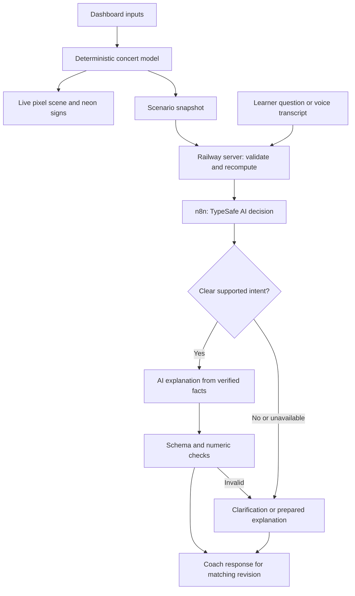

# Flow4Gold — Addendum 03: The Concert, Pixel Art and Live Dashboard

Prepared for Alicia Graham · 30 September 2026  
Project: **The Economics of Everything**  
Target: https://web-production-af12a.up.railway.app/lessons/concert-economics?lang=en  
Implementation environment: existing repository in VS Code with Codex; local Blender; existing Railway deployment; n8n Cloud.

## 1. Purpose and instruction priority

Build one memorable, interactive concert economics experience: a retro pixel-art DJ performing in an animated venue, with a crowd and neon business metrics that respond to a dashboard.

This addendum supersedes conflicting product requirements in the original Flow4Gold build brief, Addenda 01 and 02, and the earlier DJ-animation prompt. Scope this revision to **The concert**. Conference and factory development is deferred. Preserve their existing code unless a shared component genuinely requires adjustment. Do not rebuild the application or change hosting providers.

The required deliverable from the implementing Codex agent is functioning code, Blender assets, integration configuration, and validation evidence. This document itself is a specification, not evidence that those changes have been implemented.

### Non-negotiable outcomes

1. A proper retro pixel-art concert scene authored and animated in Blender, featuring a recognizable DJ working two turntables and a mixer, dancing people, speakers, stage equipment, and moving lights.
2. Live audience additions and removals tied to the calculated attendance. A fixed crowd video does not satisfy this requirement.
3. Live neon signs for revenue, total costs, profit/loss, and ROI; an audience/occupancy sign remains visible.
4. One visual experience. Remove **Lightweight view** and alternative renderer/view selectors. Keep pause and reduced-motion support within that same experience.
5. Replace `01 / The concert` with **The concert** and update the description below the headline.
6. Replace **Try a change** with **Mix Your Margins**, presented as a practical dashboard with adjustable sliders and editable number fields.
7. Add a dropdown for additional variables, including location presets with transparent assumptions.
8. Replace CU/currency units with **$**, with USD identified once. Location changes do not silently change currency.
9. Integrate the actual **TypeSafe AI node in n8n** for a useful, testable decision task. Keep arithmetic deterministic.

## 2. Evidence reviewed and limitations

The three supplied screenshots were opened and reviewed. They show the cream/teal page, a low-poly concert scene, a two-control right column, the Lightweight view button, a separate results strip, stacked disclosures, and the question/voice area.

The live concert page and its methodology page were inspected through the browser on 30 September 2026. The live page exposes English and German, direct numeric inputs and sliders, audience and cost assumptions, scenario reset/save/undo, a short-story control, and a microphone button. Existing numeric editing should be improved and extended rather than described as entirely missing.

Observed default calculation:

| Item | Observed default |
|---|---:|
| Ticket price | 20 CU |
| Venue capacity | 200 |
| Buyers at the reference price of 20 | 150 |
| Price sensitivity | 1 |
| Stage/DJ/production cost | 1,000 CU |
| Venue rate per capacity place | 2.50 CU |
| Services per attendee | 5 CU |
| Revenue | 3,000 CU |
| Total cost | 2,250 CU |
| Profit | 750 CU |
| Return on cost, shown in methodology | 33.33% |

A live capacity change from 200 to 400 left attendance at 150, raised costs to 2,750, and reduced profit to 250. Defaults were restored afterward. This is economically coherent: extra capacity does not itself create demand. Retain that relationship.

The YouTube reference could not be retrieved for playback in this review. Treat it as a user-provided art-direction reference, not a visually verified source:
https://www.youtube.com/shorts/RvFAbyJ3Yj4

The repository, local Blender installation, n8n account, and Railway configuration were not inspected in this document-writing session. The implementing agent must inspect them before choosing file paths, package APIs, workflow node versions, or deployment commands.

## 3. Exact copy and page structure

| Element | Required copy or behavior |
|---|---|
| Eyebrow | **The concert** |
| Main headline | **A full house. A better business?** — retain the question mark; a full venue does not guarantee profit. |
| New description | **Set the price. Build the crowd. See what pays. Adjust your ticket price, venue and event costs, then watch the dance floor and neon signs respond. Can you put on a great night and still make a profit?** |
| Small model note | **An interactive teaching simulation · All amounts in US dollars ($).** |
| Scene label | **Your concert, live** |
| Dashboard heading | **Mix Your Margins** |
| Dashboard subtitle | **Your concert dashboard. Move a slider or type a number to see what changes.** |
| Additional-controls dropdown | **Add a variable…** |
| Change explanation | **Your last move** |
| Scenario reset | **Reset concert** |
| Saved comparison | **Save this mix** |
| Chat heading | **Ask your concert coach** |
| Chat description | **Ask why a number changed, or explore your next move.** |

Desktop: make the scene the visual focus on the left, approximately two-thirds of the working area; place the dashboard on the right. Show the neon metrics inside the scene composition. Place a compact “Your last move” explanation immediately below it. Put the coach and detailed cost breakdown below the working area. Avoid a long sequence of unrelated accordions between the scene and its controls.

Mobile: retain the same scene and art direction. Stack the dashboard beneath it. Reflow signs so labels and numbers remain readable. Do not create a second visual mode or hide essential levers. The scene should remain usable without dragging a camera.

Retain the recognizable site logo and cream/teal identity around a dark, neon concert interior. Make the dashboard visually compatible with the scene through restrained neon accents and clear high-contrast controls. Keep body text and form labels easy to read; reserve pixel typography for short display headings and signs.

## 4. Art direction and Blender production

### Scene composition

Use a slightly elevated, front three-quarter view. Show a substantial stage at the back and a dance floor in the foreground. The DJ, turntables, audience, and metric signs must be legible at the default camera position.

Create recognizable stylized people with heads, hair, faces, clothing, articulated arms, and distinct silhouettes. They should read as pixel-art characters, with deliberately simplified details. Avoid presenting placeholder dots, capsules, or unrefined blocks as finished people.

The booth includes two turntables, rotating records, tonearms, a central mixer, faders, knobs, LEDs, cables, and headphones. Add speaker stacks, lighting trusses, a venue entrance, and stage decoration. Use deep navy/purple with cyan, magenta, and warm gold highlights. Keep shadows controlled so the DJ’s hands and record surfaces remain visible.

### Required motion

- The DJ nods and sways, scratches a record with visible hand contact, adjusts a mixer control with the other hand, acknowledges the crowd, and returns naturally to the starting pose.
- Records rotate, with the scratched record following the hand during contact.
- Crowd characters have at least four varied dance loops with offset timing; include sway, step, head nod, and occasional arm lift.
- Light beams sweep gently; the booth’s lights pulse with an implied beat. No intense strobing.
- Use an approximately eight-second seamless performance loop with 24 fps source animation. A 120 BPM visual rhythm is a useful starting point. Smooth playback is more important than preserving a number if the art needs refinement.
- Keep a stable camera. Remove old camera-tour controls if they add complexity without teaching value.

### Asset strategy

Build the venue, DJ, and a reusable character set in Blender, with source `.blend` files and reproducible Python scripts. Export the scene and animation to assets supported by the existing Babylon.js application, preferably GLB for the live scene. Inspect the installed Blender version and exporter options rather than assuming a version from a linked release page.

Implement the retro pixel appearance in the runtime presentation as well as the Blender preview. Prototype a low-resolution render target with nearest-neighbor enlargement and deliberately chosen pixel textures. Tune resolution for readable silhouettes; start near 640 × 360 for the wide scene. Keep metric text crisp through a separate UI layer. Verify sampling APIs against the installed Babylon.js version.

Do not assume a Blender compositor effect, procedural material, volumetric light, or lighting animation survives GLB export. Bake suitable material details, use supported animation channels, and recreate necessary light/glow effects in the browser. Compare a rendered Blender preview with the actual browser scene.

A Blender-rendered layered sprite implementation is an acceptable internal optimization only if it preserves the same finished pixel-art scene, independently animated characters, and live crowd control. It is not an alternative user-selectable view. Prefer the existing engine before adding another rendering framework.

A preview video may document the artwork or support “Watch the short story.” It must not replace the live audience simulation.

### Visual quality gate

Render and inspect an early frame and a short loop before integrating final assets. Check the DJ’s hands, record contact, recognizable crowd silhouettes, lighting, pixel edges, and the loop seam. Then inspect the integrated version again. File export success alone is not visual acceptance. Do not claim to have inspected the reference video if it cannot be played.

## 5. Live audience behavior

The simulation has two distinct quantities: **venue capacity** and **people attending**. The crowd represents people attending. Empty floor space represents unused capacity.

In estimated mode, attendance follows the demand model and is capped by capacity. In manual mode, the user sets a requested headcount, capped by capacity. Ticket price changes do not change that manually chosen attendance; explain this directly next to the manual control.

For ordinary capacities, aim for one visible character per attendee, using reusable optimized characters. For large venues, use grouped representation with an explicit scale instead of rendering thousands of expensive skeletons. Implement a predictable mapping; for example, with a 300-character scene budget:

```text
peoplePerFigure = max(1, ceil(capacity / 300))
occupiedFigures = attendance == 0 ? 0 : ceil(attendance / peoplePerFigure)
availableFigureSlots = ceil(capacity / peoplePerFigure)
```

The final occupied figure may represent a partial group. Always show the exact attendee count. When grouping is active, label it **“Crowd illustration: each figure represents up to N guests.”** Do not describe representative figures as an exact visible headcount. Capacity changes can change this display scale; attendance changes at a fixed capacity must be monotonic in visible crowd size.

Within a given scale, add/remove people smoothly from stable slots. Reuse characters and animation resources. Do not scatter the entire crowd randomly on each input. At zero attendance, show an empty dance floor while the DJ continues. When motion is paused or reduced, still update the current headcount and metrics immediately, without transition animation.

Support capacities well above 200; proposed first-release supported range: **1–10,000 people**. Put the limit in a shared configuration so it is not a hidden hardcoded UI constraint. Scene layout should communicate occupancy and have space for the modeled venue size without requiring the camera to move on every slider change.

## 6. Neon metrics

Use concert-style illuminated sign housings around the stage or its upper border. The values must remain live and readable on mobile. A DOM overlay aligned with the sign artwork is preferred for accessible labels and reliable number formatting; decorative in-scene text may mirror it from the same state.

| Sign | Meaning | Default display |
|---|---|---:|
| **Audience** | Actual modeled attendance, plus venue capacity | **150 / 200** |
| **Revenue** | Ticket revenue plus sponsorship if enabled | **$3,000** |
| **Total costs** | Every cost included in this teaching model | **$2,250** |
| **Profit** / **Loss** | Revenue minus total costs | **$750** |
| **ROI** | Profit divided by total costs, multiplied by 100 | **33.3%** |

An occupancy sublabel can read **75% full**. Label loss explicitly and retain a minus sign, rather than relying on red color. Show ROI as **—** when total costs are zero, with **“ROI needs a cost greater than $0.”** Do not display Infinity or NaN.

ROI help text: **“Return on your event costs: profit ÷ total costs × 100. An ROI of 20% means $0.20 profit for every $1 spent.”** This is the event’s modeled return on cost, not profit margin, sponsor ROI, or the ROI of the learning platform.

Use one result object for the signs, cost breakdown, explanations, saved scenarios, coach context, and any exported summary. Preserve exact currency values in accessible detail; compact display must not hide discrepancies. Use a shared formatter for `$`, thousands separators, decimals, and negative amounts. Identify USD once, including in German. A location change does not trigger currency conversion.

Remove the redundant old solid-teal results strip once the neon signs fulfill its function. Provide keyboard-accessible help for metric definitions. Use debounced announcements for screen readers so slider movement does not produce an overwhelming stream of messages.

## 7. Dashboard specification

### Always visible

| Label | Control | Helper text / effect |
|---|---|---|
| **Ticket price** | Dollar-prefixed number field + slider | “What each guest pays to enter.” |
| **Venue capacity** | Whole-number field + slider | “How many guests the venue can hold. Extra space does not create demand.” |
| **Location** | Dropdown | Applies a named, fictional location profile; show the exact assumptions changed. |
| **Audience** | Estimated/manual selector; contextual number field | Estimated: **“Interested guests at $20”**. Manual: **“Guests attending”**. |

Default audience mode is **Estimate from ticket price**. Alternative modeling choice is **Set attendance myself**. These change calculation assumptions, not the visual renderer. Use plain helper text so the two modes are not mistaken for alternative scene views.

For estimated mode: **“At a $20 ticket price, this many people would want to come. Changing the price changes the estimate.”** For manual mode: **“You choose the crowd size. Ticket-price changes affect revenue, while this headcount stays fixed.”**

### Add a variable dropdown

Use a dropdown labeled **Add a variable…** with the options below. Selecting an option reveals a clearly labeled control row within the dashboard. Exclude already-visible options. Each added row can be removed; removal explicitly resets its value to the active profile’s default and participates in Undo. Never hide an active non-default value without exposing it in the summary.

| Variable shown to the learner | Control | Defined effect |
|---|---|---|
| **DJ, stage & sound** | Dollar number + slider | Fixed production cost. |
| **Venue cost per place** | Dollar number + slider | Rate × venue capacity; also show **Venue hire total** in dollars. |
| **Cost per guest** | Dollar number + slider | Services cost × actual attendance. |
| **Promotion budget** | Dollar number + slider | Added fixed cost; does not automatically create buyers. |
| **Extra interest from promotion** | Percentage number + slider | Explicit assumed increase in interested guests, used only in estimated mode. |
| **Sponsor contribution** | Dollar number + slider | Adds revenue; show ticket and sponsor revenue separately in detail. |
| **How much price matters** | Low / Medium / High dropdown + optional numeric edit | Maps to sensitivity values 0.5 / 1 / 2; numeric custom values permitted. |

Promotion helper: **“Spending more does not guarantee more buyers. Set the audience boost you want to test.”** Do not infer a causal advertising effect from money spent. Keep the boost visible in the assumptions summary whenever it is nonzero. In manual mode disable the boost with an explanation and retain its stored value for returning to estimated mode.

### Location presets

Use fictional **location types** rather than inventing real market data about cities. Required options:

| Preset | Interested guests at $20 | Production cost | Venue cost per capacity place | Cost per attendee |
|---|---:|---:|---:|---:|
| **Neighborhood club** — default | 150 | $1,000 | $2.50 | $5 |
| **City-center venue** | 600 | $2,000 | $4.00 | $7 |
| **Outdoor concert space** | 1,200 | $4,000 | $1.50 | $6 |
| **Custom location** | User-editable | User-editable | User-editable | User-editable |

These numbers are **proposed fictional teaching inputs**, not researched prices or demand estimates. Display **“Illustrative location presets, not live venue quotes.”** Keep the active profile’s assumptions inspectable.

Selecting a preset updates the four columns above in one transaction, plus the displayed location name. It preserves ticket price, capacity, sensitivity, promotion settings, sponsorship, audience mode, and manual attendance. In manual mode the new base demand is stored but unused. Show exactly what changed and offer one-step Undo. Editing a preset’s four underlying values changes its label to **Custom location**, preserving the edited values. Scene backdrop changes are optional polish; the economics and clear location label are required.

### Manual entry and ranges

Every numeric lever must accept typing and keyboard operation, even when a slider is provided. Numeric field and slider must share one value. Allow transient empty text during editing, validate on commit, and give inline errors rather than silently coercing input. Update valid values promptly; one drag or committed edit is one Undo action.

Proposed shared limits: ticket price $1–$1,000; capacity 1–10,000; interested guests 0–100,000; requested manual attendance 0–10,000; sensitivity 0–3; promotion boost 0–300%; monetary budgets $0–$1,000,000; venue rate and per-guest cost $0–$1,000. Allow cents for dollar fields and whole numbers for people. Use a practical slider subrange where needed, but accept any valid typed value within the documented full range and show that value correctly. The current paid-ticket demand formula requires a positive price: explain **“Use $1 or more for this paid-ticket model.”** Free-event modeling is outside this revision rather than handled with division by zero.

## 8. Deterministic calculation contract

Preserve the existing isoelastic teaching model, observed on the methodology page, and extend it explicitly. Do not ask an AI model to compute or invent these numbers.

```text
P = ticket price in dollars, P >= 1
C = venue capacity, integer >= 1
M = interested guests at the reference price of $20
e = price sensitivity
b = assumed promotion boost as a decimal, e.g. 0.20 for 20%
F = DJ/stage/sound cost
v = venue cost per place of capacity
g = cost per attendee
B = promotion budget
S = sponsor contribution
H = requested attendance in manual mode

potentialDemand = floor(M * (1 + b) * (P / 20)^(-e))
attendance = estimated mode ? min(C, potentialDemand) : min(C, H)
unmetDemand = estimated mode ? max(0, potentialDemand - C) : not applicable
occupancyPct = 100 * attendance / C
venueCost = v * C
guestCost = g * attendance
totalCosts = F + venueCost + guestCost + B
ticketRevenue = P * attendance
totalRevenue = ticketRevenue + S
profit = totalRevenue - totalCosts
roiPct = totalCosts > 0 ? 100 * profit / totalCosts : null
```

Use nonnegative validated inputs for all costs, demand, and sponsorship. Represent money in cents or a consistent decimal-money library. Calculate demand separately, then multiply integer attendance by monetary amounts. Prevent floating-point noise from turning an exact whole-person result such as 100 into 99. Display one decimal place for ROI; preserve calculation precision internally. The model excludes tax, financing, refunds, and other unmodeled costs; state that briefly in the breakdown.

If manual attendance exceeds capacity, show the cap and the requested value clearly: **“You requested 300 guests; this venue holds 200. Attendance is capped at 200.”** Do not silently change capacity or hide the limit. Returning to estimated mode recalculates from stored demand assumptions.

Use a model version and monotonically increasing scenario revision. Compute immediately in the browser for responsiveness and recompute/validate on the server for AI context. Do not send every slider tick to n8n. Do not reload the scene or rebuild all assets on each change.

### Exact acceptance examples

All rows use default production $1,000, venue rate $2.50, guest cost $5, sensitivity 1, zero promotion, zero sponsorship, and interested guests 150 unless a row says otherwise.

| Change | Attendance | Revenue | Costs | Profit | ROI |
|---|---:|---:|---:|---:|---:|
| Default: price $20, capacity 200 | 150 | $3,000 | $2,250 | $750 | 33.3% |
| Price $30, capacity 200 | 100 | $3,000 | $2,000 | $1,000 | 50.0% |
| Price $10, capacity 200 | 200 | $2,000 | $2,500 | −$500 | −20.0% |
| Price $20, capacity 400 | 150 | $3,000 | $2,750 | $250 | 9.1% |
| Price $20, capacity 1,000, interested guests 800 | 800 | $16,000 | $7,500 | $8,500 | 113.3% |
| Default plus $500 sponsorship | 150 | $3,500 | $2,250 | $1,250 | 55.6% |
| Default plus $100 promotion and 20% assumed boost | 180 | $3,600 | $2,500 | $1,100 | 44.0% |
| Manual: 80 guests, price $30, capacity 200 | 80 | $2,400 | $1,900 | $500 | 26.3% |

At zero demand, attendance is zero and fixed costs still exist. At zero total cost, ROI is undefined. At a capacity limit, raising demand cannot produce extra ticket revenue until capacity allows extra attendance.

## 9. Interaction and teaching improvements

Make “Your last move” explain the latest committed change with actual numbers. Example: **“You raised the ticket price from $20 to $30. Estimated attendance fell from 150 to 100. Revenue stayed at $3,000, but serving fewer guests lowered costs by $250. Profit rose to $1,000.”** Build routine explanations deterministically so they remain immediate and accurate.

Use a small **Compared with your saved mix** summary after Save this mix. Save the full input state, model version, currency, active mode, location assumptions, and calculated snapshot. Restore through validation and recalculate; do not trust old cached metrics. If persistence already exists, use it and migrate older CU-based saves explicitly. This unit presentation change does not convert old numerical values using an exchange rate.

Retain Undo, Reset, the short story, and the working text/voice coach. Reset must restore all default concert assumptions, custom-variable visibility, and calculation mode coherently. An undo should restore a whole location preset or whole slider action, not one keystroke at a time.

Keep the microphone button and clear recording/listening/processing states. Preserve the warm female Caribbean voice preference for English audio where the configured voice supports it; do not claim exact accent matching without listening. Keep captions/transcripts and explicit audio playback controls. Avoid automatically playing music over narration. English and German strings must remain coherent, including new dashboard controls and `$` formatting.

## 10. Application architecture



This is a proposed architecture to adapt to the repository, not a claim about its current internals.

Keep the fast path local: controls → model → crowd/signs. Keep AI on the explicit question path. Suggested responsibilities are a shared concert-model module, validated scenario schema, dashboard component, scene adapter, common currency formatter, coach server handler, and versioned n8n workflow. Adapt naming and paths to the actual codebase.

Use immutable or consistently versioned snapshots. A response to revision 12 must not overwrite explanations or numbers for revision 13. While a question is in flight, either label its answer as applying to the submitted settings or discard it with a brief request to ask again. AI responses cannot directly mutate scene state. A proposed change can be shown as an explicit Apply action and validated like a normal lever edit.

Blender runs during development/asset production, not on each visitor request and not on a slider change. Railway serves the existing app and assets; n8n coordinates questions. Do not introduce Flamenco, another hosting service, or a render farm for this task.

## 11. TypeSafe AI in n8n

### Verified references and bounded purpose

n8n’s integration listing identifies a TypeSafe-maintained, verified integration. The official repository names the package **`@typesafe-ai/n8n-nodes-typesafe-ai`** and documents **Evaluate** and **Route** operations. The official TypeSafe documentation describes typed questions and structured decisions, including Choice, Score, and Noul. Verify availability and installed versions in the user’s n8n Cloud instance before generating an import file. [S1–S3]

Use the native node as requested. Similar unscoped community packages exist; do not substitute one based only on a similar name. If the official node is unavailable in the account, report the exact blocker and prepare the rest of the integration. A documented HTTP adapter can be a clearly labeled interim option, but it does not satisfy the native-node acceptance criterion by itself.

### Proposed job: identify the learner’s question

Use one Evaluate node to classify a learner question into this application-defined Choice taxonomy:

| Choice | Explanation focus |
|---|---|
| `ticket_price` | Price, demand, and ticket revenue |
| `audience_capacity` | Crowd size, occupancy, and capacity limits |
| `costs` | Venue, production, guest services, and promotion |
| `profit_roi` | Profit/loss and return on event costs |
| `location` | What the fictional location preset changes |
| `compare_scenarios` | Current vs saved input/result snapshots |
| `unclear_or_other` | Clarify or redirect to the concert lesson |

Pass the question, selected language, audience mode, and server-verified scenario facts as state. Optional second atomic question: whether the request needs real-world data absent from the simulation. Configure these questions in the actual node UI or the documented API schema. The taxonomy above is our application design, not a vendor-provided preset.

After Evaluate, use explicit n8n branching. Start with a configurable Choice-confidence threshold of **0.80** as a provisional application setting; evaluate it on a small labeled sample before treating it as useful. This is not a promise of 80% accuracy. Below the threshold, ask a focused clarification or supply a clearly labeled prepared explanation. Do not let a low-confidence classification change the economics.

The selected route tells the existing language model which lesson facts and concept to explain. TypeSafe is not the arithmetic engine, investment adviser, or proof that the answer is correct. Validate answer structure and any numerical claims against the shared model. Prefer inserting computed figures into controlled explanation fields; reject or replace mismatched figures with a prepared response. Never display a blanket “TypeSafe verified” guarantee.

### Workflow construction and setup

1. Inspect the existing concert workflow, trigger, server contract, and credential references. Reuse them where compatible.
2. In n8n Cloud, inspect the node picker for **TypeSafe AI** and its publisher. If absent, the instance owner should use the verified-community-node installation flow available in their account. Do not offer self-hosted shell installation instructions as though they apply to n8n Cloud.
3. Confirm whether the user already has a TypeSafe account/key before proposing a new account. Store the key in n8n credentials. Keep provider keys and webhook authentication out of frontend code, screenshots, exports, and chat.
4. Configure Evaluate with the actual model available to the account, JSON state, the application questions, and explicit uncertainty/error handling. Record package and model versions.
5. Connect the confidence branch to the explanation or clarification paths. Reuse the current LLM and voice services. Route errors and timeouts to a prepared explanation; leave the local simulation operational.
6. Add bounded timeouts/retries within the request budget, protect the Railway-to-n8n webhook, and prevent public abuse. Do not send unrelated user data or API secrets in the evaluation state.
7. Export a credential-free workflow and a setup guide. Verify import and execution against the actual installed node schema; do not invent node `type`, `typeVersion`, parameters, or credential IDs.
8. Test clear questions, ambiguous questions, unavailable service, authentication failure, and rate limiting. Report real execution evidence separately from mocked tests.

### Proposed app-level contract

This JSON is an internal server/workflow contract to adapt, **not the TypeSafe API request schema**:

```json
{
  "requestId": "unique-request-id",
  "scenarioRevision": 12,
  "modelVersion": "concert-v2",
  "lessonId": "concert-economics",
  "language": "en",
  "question": "Why did profit rise when fewer people came?",
  "scenario": {
    "currency": "USD",
    "audienceMode": "estimated",
    "ticketPriceCents": 3000,
    "capacity": 200,
    "baseDemandAt20": 150,
    "priceSensitivity": 1,
    "productionCostCents": 100000,
    "venueRateCents": 250,
    "perGuestCostCents": 500,
    "promotionBudgetCents": 0,
    "promotionBoost": 0,
    "sponsorshipCents": 0
  },
  "verifiedResults": {
    "attendance": 100,
    "revenueCents": 300000,
    "costCents": 200000,
    "profitCents": 100000,
    "roiPct": 50
  }
}
```

The server supplies verifiedResults after recomputation. Keep a submitted question’s snapshot separate from later slider state. Return requestId, scenarioRevision, explanation, source status, and an optional clarifying question through the existing response contract. Keep internal provider diagnostics out of the learner interface.

## 12. Implementation order and deliverables

Implement in this order, completing each working slice:

1. Inspect repository instructions, current model, scene system, translations, assets, workflow, and Railway setup. Record a baseline screenshot and tests. Use a reversible branch and preserve unrelated work.
2. Centralize the model/state/formatting. Add the acceptance examples and scenario schema. Preserve current default results.
3. Build Mix Your Margins, editable levers, dropdown variables, location presets, audience modes, Undo/Reset/Save, and updated copy.
4. Author a Blender preview and refine it. Export animated assets and integrate the single pixel-art runtime scene with live crowd density.
5. Bind the neon signs and all explanations to the shared model. Remove Lightweight view and redundant results UI.
6. Add TypeSafe to the existing n8n flow; validate credentials/configuration and test real calls when access is available.
7. Verify responsive rendering, accessibility, translations, audio controls, asset loading, and numerical consistency. Prepare the existing Railway deployment path and release notes. Follow the project’s existing deployment authorization; do not claim deployment unless it actually occurred and was checked.

Deliver editable `.blend` files, generation/export scripts, optimized runtime assets, updated application code, numerical tests, credential-free n8n workflow export, setup notes, and before/after desktop/mobile captures. Include a short preview recording showing an actual lever change and the matching crowd/sign response. Record asset sizes and measured performance, rather than declaring unmeasured optimization success.

Suggested asset categories, to adapt to the repo: `assets/blender/`, `scripts/blender/`, `public/assets/concert/`, `workflows/`, `docs/`. Do not create a parallel app or duplicate the whole project solely to match these names.

## 13. Acceptance checklist

- [ ] The page says **The concert**, with no `01 /` prefix, and uses the new description.
- [ ] **Mix Your Margins** is visible beside the scene on desktop and accessible below it on mobile.
- [ ] The finished scene is distinctly retro pixel art, with a recognizable performing DJ, two turntables, mixer, varied dancing people, and moving lights.
- [ ] Blender source and reproducible scripts exist; exported animation plays correctly in the browser.
- [ ] A fixed movie has not replaced the live scene.
- [ ] Changing $20 → $30 → $10 at default assumptions shows 150 → 100 → 200 attendees and matching crowd changes.
- [ ] Increasing capacity alone does not fabricate demand; lowering capacity can cap attendance.
- [ ] Manual audience editing works, respects capacity, and explains why price no longer changes that headcount.
- [ ] Capacities above 200 work, including 1,000 and the documented upper limit. Grouped crowd display is explicit and accurate.
- [ ] All neon signs agree with the dashboard, breakdown, saved state, and coach snapshot, including negative profit and zero-cost ROI.
- [ ] No CU labels remain in concert UI, methodology, generated replies, captions, tooltips, or newly saved/exported concert summaries.
- [ ] Every numeric lever accepts typed values; sliders stay synchronized; invalid/empty inputs do not cause jumps or crashes.
- [ ] Added variables change their defined model term. Location presets show their assumptions, preserve unrelated controls, and undo in one action.
- [ ] “Your last move” explains actual causes using actual figures, with no generated invented numbers.
- [ ] There is no Lightweight view or alternate-renderer selector. Pause/reduced motion retains the same scene and allows state updates.
- [ ] Voice/text coaching and English/German continue to work; audio is user-controlled.
- [ ] TypeSafe’s real native n8n node is configured and tested, or the exact account/node blocker is explicitly marked incomplete.
- [ ] Uncertainty and service failures return clarification/prepared text without breaking the simulation.
- [ ] A stale AI reply cannot overwrite a newer scenario.
- [ ] Desktop and 390 px-wide mobile layouts have readable signs, reachable controls, and no horizontal overflow.
- [ ] Check a real mobile device when available; distinguish that evidence from desktop viewport emulation.
- [ ] Public assets load through the existing Railway route; no secrets are bundled into the client.

## 14. Reference links and provenance

User’s site: https://web-production-af12a.up.railway.app/lessons/concert-economics?lang=en  
Observed methodology: https://web-production-af12a.up.railway.app/methodology?lesson=concert-economics&lang=en  
User’s pixel-art reference, playback unverified in this review: https://www.youtube.com/shorts/RvFAbyJ3Yj4

- **[S1] n8n TypeSafe integration listing:** https://n8n.io/integrations/typesafe-ai/ — retrieved search listing described the verified partner node; verify account availability during implementation.
- **[S2] Official TypeSafe n8n repository:** https://github.com/typesafe-ai/n8n-nodes-typesafe-ai — reviewed for the scoped package and documented operations. Use its current README and node schema for installation/configuration.
- **[S3] TypeSafe introduction:** https://docs.typesafe.ai/introduction — reviewed for typed decision primitives and structured results.
- **[S4] Blender glTF exporter manual:** https://docs.blender.org/manual/en/5.3/addons/scene_gltf2.html — retrieved as an exporter reference; use documentation matching the locally installed Blender version rather than requiring version 5.3.
- Blender home/download: https://www.blender.org/ and https://www.blender.org/download/
- Blender Python quick start: https://docs.blender.org/api/current/info_quickstart.html
- Blender source: https://projects.blender.org/blender/blender
- Blender manual source: https://projects.blender.org/blender/blender-manual
- Blender Studio tools: https://studio.blender.org/tools/overview/introduction
- Blender Studio training: https://studio.blender.org/training/
- Babylon.js documentation: https://docs.babylonjs.com/ — implementation reference; use installed-version APIs.
- n8n documentation: https://docs.n8n.io/
- TypeSafe home: https://typesafe.ai/

Other links above are implementation/reference entry points, not claims that every linked page or video was inspected. Library versions, package names, and service availability must be checked in the development environment.

## 15. Full Codex implementation prompt

Copy the following section into Codex in VS Code after placing this Markdown file in the existing project. The same prompt is supplied separately as `Flow4Gold_Concert_Codex_Prompt.md`.

<!-- CODEX_PROMPT_START -->
Implement `Flow4Gold_Addendum_03_Concert_Pixel_Dashboard.md` in the existing “The Economics of Everything” repository. Read the entire addendum and repository instructions before editing. This is an implementation task: produce working assets, code, integration configuration, and verification evidence.

We are focusing only on **The concert**. This addendum overrides conflicting product directions in earlier Flow4Gold briefs and the earlier DJ prompt. Preserve unrelated work and the current Railway deployment architecture. Blender is installed locally; inspect the executable/version and existing scene pipeline.

Current page: https://web-production-af12a.up.railway.app/lessons/concert-economics?lang=en

Art reference: https://www.youtube.com/shorts/RvFAbyJ3Yj4. Inspect it if accessible. If it is unavailable, use the addendum’s explicit art direction and say that playback was unavailable. Do not claim a visual match you have not checked.

First inspect the existing concert model, controls, Babylon.js scene, translations, coach API, n8n workflow, assets, and build/deployment scripts. Work in a reversible branch or the project’s established change workflow. Keep useful existing functionality. Adapt file paths to the actual repository; do not start a replacement application.

Build these requirements fully:

1. Change `01 / The concert` to `The concert`. Keep `A full house. A better business?`. Replace its description with: “Set the price. Build the crowd. See what pays. Adjust your ticket price, venue and event costs, then watch the dance floor and neon signs respond. Can you put on a great night and still make a profit?”

2. Recreate the concert in Blender as a polished retro pixel-art scene: recognizable DJ, articulated hands visibly scratching records and adjusting a mixer, two turntables, headphones, speakers, stage, moving lights, and varied dancing people. Create editable Blender source and reproducible scripts. Export and verify animated assets in the existing browser renderer. Apply the pixel-art style to the runtime scene; a normal low-poly model is not finished pixel art.

3. Keep the scene live. Crowd size must add/remove people when the calculated attendance changes. A fixed video cannot be the primary scene. Reuse character variants and animation loops, and use the addendum’s explicit grouped representation for large capacities. Show exact attendance and occupancy. Support capacity above 200, up to the configured 10,000-person limit. A larger venue alone must not invent demand. Keep the same art direction on desktop and mobile.

4. Display live neon signs within the scene composition for Audience, Revenue, Total costs, Profit/Loss, and ROI. Bind everything to one deterministic result object. Preserve the existing ROI meaning: profit / total costs × 100. Undefined ROI at zero costs shows a dash with an explanation. Use readable accessible sign text and a clear negative-value display.

5. Remove Lightweight view and alternate-renderer controls. Keep pause and reduced motion within the same scene. When animation is paused, lever changes must still update attendance and all numbers. In a rendering failure, keep accessible metrics/dashboard and a clear retry message; do not expose a second scene mode.

6. Replace Try a change with Mix Your Margins. Make the right side a dashboard with sliders AND editable numeric fields, clear units, inline validation, and one-action Undo. Always expose ticket price, capacity, Location, and Audience controls. Audience supports Estimate from ticket price or Set attendance myself, with clear explanations and capacity limits.

7. Implement Add a variable… as a dropdown that reveals optional controls for DJ/stage/sound, venue cost per place, cost per guest, promotion budget, assumed extra interest from promotion, sponsor contribution, and price sensitivity. Follow the model effects and removal/reset behavior in the addendum. No cosmetic controls without defined effects.

8. Implement Neighborhood club, City-center venue, Outdoor concert space, and Custom location using the addendum’s fictional preset table. Label them as illustrative, not real venue quotes. Preserve unrelated settings when switching locations, show the changes, and make the whole switch undoable. Editing preset values creates Custom location. Keep USD throughout.

9. Replace CU with $ everywhere relevant to the concert: labels, helpers, results, methodology, voice/text responses, captions, saves, and exports. Identify USD once. Use a shared formatter and consistent monetary precision. Do not treat this display/model-unit change as a real exchange-rate conversion.

10. Preserve the existing isoelastic demand model and extend it exactly as specified. Keep calculations in shared deterministic code, independent of AI. Validate positive ticket prices and all input ranges; handle zero demand, zero costs, negative profits, and capacity limits. Use the addendum’s numerical acceptance table as regression fixtures.

11. Integrate the official native TypeSafe AI node in the existing n8n Cloud workflow. Verify `@typesafe-ai/n8n-nodes-typesafe-ai`, the installed node schema/version, and model availability from the official references. Use Evaluate to classify question intent, then explicitly branch on confidence to an explanation or clarification. Keep the proposed 0.80 threshold configurable and test it; it is not an accuracy guarantee. Do not use TypeSafe to calculate money or portray its output as mathematical certification.

12. Keep secrets in n8n credentials/server configuration. Confirm existing account availability before proposing new accounts. Do not fabricate credentials, node IDs, node versions, model names, or a successful connection. If access is missing, finish the local work, provide a credential-free workflow/setup guide as far as the verified schema allows, and list the exact activation step that remains. An HTTP substitute must be clearly labeled and does not complete the native-node requirement.

13. Keep the coach and microphone usable, with the existing warm female Caribbean English voice preference where supported, captions, and user-controlled playback. Supply the server-verified current scenario to the coach. Prevent stale responses from affecting newer scenario revisions. Routine “Your last move” explanations should use deterministic figures. Preserve English and German.

14. Verify the finished experience, not just compilation. Inspect Blender preview frames and animation, the exported browser scene, crowd responses at multiple prices/capacities, typed and slider input, location changes, ROI, Undo/Reset/Save, mobile layout, reduced motion, translations, and failure paths. Distinguish mocked checks from real n8n executions and desktop emulation from actual mobile testing.

Deliver updated code; editable `.blend` files; generation/export scripts; optimized runtime assets; numerical regression checks; a credential-free n8n workflow export and setup guide; before/after desktop/mobile screenshots; and a short capture showing a real lever change affecting the crowd and signs. Record asset sizes and observed performance. Follow the existing Railway release workflow and authorization; state separately whether changes are local, previewed, or deployed.

Proceed with reasonable implementation decisions. Do not stop after writing a plan or producing placeholder visuals. When a dependency blocks one part, complete the unblocked work and report the specific missing access or execution step. Finish with a concise account of what changed, what was tested, and what remains incomplete.
<!-- CODEX_PROMPT_END -->
