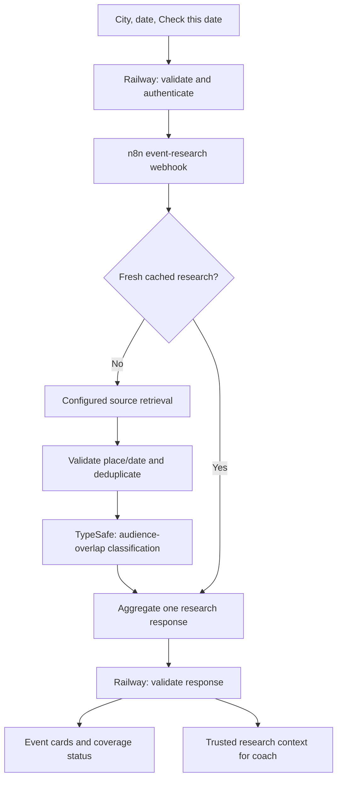

# Flow4Gold — Addendum 04
## Preserve the concert; redesign its controls; connect city/date research through n8n

Prepared for Alicia Graham · 30 September 2026, America/New_York  
Application: **The Economics of Everything — The concert**  
Approved page: https://web-production-af12a.up.railway.app/lessons/concert-economics?lang=en  
Environment: existing VS Code repository, local Blender, Babylon.js, Railway, and n8n Cloud.

## 1. Governing instructions

**The current concert scene is approved. Preserve it exactly.** Do not recreate, restyle, rerender, replace, or reposition its DJ, audience, venue, lights, camera, materials, animation, neon signs, or assets. Existing crowd changes in response to economic inputs must continue. “Preserve” means retain those approved visual behaviors, not freeze the audience count.

This revision has two workstreams:

1. Give the existing **Mix Your Margins** dashboard the appearance of an animated 3D retro pixel-art turntable/mixer. Its functions remain the same.
2. Add city/date planning and sourced information about other events, with an explicit, tested connection between the application and the actual n8n canvas workflows.

Use **Blender for the new dashboard asset and Babylon.js for runtime presentation**. Do not introduce HyperFrames. Reading its guidance in an earlier session is not evidence that it was installed; inspect the repository before removing anything.

This addendum overrides conflicting product instructions in earlier briefs, especially any instruction to rebuild the concert scene or use a generic venue profile as the sole meaning of Location. Retain the economics, USD formatting, voice functionality, multilingual support, no-Lightweight-view requirement, and other working features from Addendum 03 unless explicitly changed below.

Do not interpret this document as permission to discard the seven-file partial edit. Audit and reconcile that work first.

## 2. What is known, and what still needs inspection

The user supplied a transcript of a partial Codex session. It reports seven edited files and names:

- `scripts/create-control-deck.py`
- `server/events.js`
- `server/index.js`

The remaining four paths, exact diffs, current runtime, and n8n changes are not visible in that transcript. The pasted session says HyperFrames was not added to the application and that the implementation switched to Blender. Verify this in the code rather than assuming either statement describes the final files.

The excerpt does **not** prove that the application is broken or that n8n was omitted. It does not demonstrate an updated canvas, matching payloads, production configuration, or a successful end-to-end execution either. Those are the gaps this addendum addresses.

The current Addendum 03 was checked for its dashboard, location, ROI, and calculation instructions. Its Location field currently means fictional venue-cost/demand presets. That concept must become **Venue setup**, separate from the new geographic **City** field.

No new turntable-reference image was attached to this document-writing request; the reference is mentioned inside the pasted transcript. The implementing agent should use it if present in the repository/session. Otherwise follow the art direction below and state the limitation without blocking the rest of the task.

The live page could not be retrieved by the research tool during this writing session. No claim is made here about its latest appearance, deployed code, or current workflow connections. The implementing agent must capture the approved visual baseline before editing. This deliverable is an implementation handoff, not a report that the changes are already running.

## 3. Inspect and preserve before editing

1. Read repository instructions and inspect Git status, staged changes, unstaged changes, untracked files, and recent commits. Record the complete list of the partial edits. Preserve unrelated user work; do not use a blanket reset, clean, or revert.
2. Read the three named files and the other changed files. Determine which pieces are functional, unfinished, redundant, or inconsistent with this addendum. Keep useful code and assets.
3. Identify the approved concert component, its asset manifest, Blender source, runtime assets, scene-specific styles, and shared render settings. Record file checksums where practical and capture the live/local scene at a reproducible scenario, camera, and animation time. If local and production scenes differ, do not guess that the local revision is the approved one; resolve the approved deployment/commit before touching scene-related code.
4. Inspect `package.json` and its lockfile for actual new dependencies. Keep Blender/Babylon as the dashboard pipeline. Remove accidental task-specific HyperFrames additions only if they exist and are unused; preserve unrelated dependencies.
5. Trace `server/events.js` from browser call to response. Is it calling a provider directly, calling n8n, using sample data, or only returning a placeholder? Do not infer this from its filename or line count.
6. Identify the existing coaching workflow and any events workflow by actual workflow ID, name, and webhook configuration. Compare repository workflow exports with the current saved canvas and the version executing in production. Document actual differences.
7. Create a rollback checkpoint using the established repository process. Export existing workflow definitions before updating them, without credential secrets or captured private execution data.

Produce a short change map before implementation, then continue with the work. Missing n8n access blocks live workflow editing/testing, not the unblocked dashboard implementation or contract preparation.

## 4. Dashboard: a functional pixel-art control deck

Retain the name **Mix Your Margins**. Suggested subtitle: **“Work the controls. See what pays.”** This is the existing dashboard in a new visual housing, not a decorative turntable next to an unchanged form.

Build a compact turntable/mixer asset in Blender with a raised dark casing, two record platters or jog wheels, a central fader bank, tactile knobs, small illuminated buttons, and recessed digital value windows. Use the approved concert’s pixel palette and compatible lighting. The dashboard should look related to the concert while remaining a separate asset/component.

Give the deck restrained motion: slowly rotating platters, gentle indicator pulses, and fader/knob movements driven by input state. Do not make decorative motion change an economic value. Retain a readable front/three-quarter view and stable controls; do not require users to rotate a camera to find a lever.

### Functional mapping

| Existing function | Turntable presentation | Required behavior |
|---|---|---|
| Ticket price | Clearly labeled fader with `$` numeric display | Drag, type, and keyboard input all change the same value. |
| Venue capacity | Second labeled fader with people display | Existing range/capacity behavior remains. |
| Audience mode and demand/headcount | Mode buttons plus numeric display | Preserve estimated/manual attendance semantics. |
| Optional economic variables | **Add a variable…** menu opening a deck expansion panel | Preserve all current variables and editable values. |
| Undo | Illuminated **Undo** button | Restore the whole last committed edit. |
| Reset | **Reset concert** button | Restore the documented defaults coherently. |
| Save | **Save this mix** button | Preserve full economic and planning state. |
| City/date planning | Clearly labeled panel attached to/below the deck | New research context; not a hidden economics preset. |

Use accessible native inputs/buttons over or alongside the Blender-rendered housing. Align the fader artwork and hit targets. If a 3D knob is directly interactive, also provide a labeled numeric field and keyboard control. Do not rely on canvas hit testing as the only way to edit values.

Keep signs, calculations, levers, undo, save, reset, additional variables, validation, and existing input ranges working. Empty text during numeric editing must not cause premature coercion. Scope new styles and post-processing to the dashboard so the approved concert does not change. Keep focus indicators, large mobile touch targets, screen-reader labels, and clear units.

On mobile, adapt the deck layout without shrinking number fields beyond usability or introducing a second rendering mode. Pause or reduce dashboard motion when requested. Scene and deck should not compete for GPU resources: reuse the existing engine where practical or measure the cost of a separate canvas. Do not alter the concert’s rendering quality to subsidize the new deck.

Deliver the dashboard `.blend`, creation/export script, optimized runtime asset, and a manifest with reproducible export instructions. A generic CSS card or a static unrelated image alone does not satisfy the requested animated Blender turntable design.

## 5. City and date planning

### City selector

The user has confirmed the geographic meanings. Do not ask again.

| Display label | Stable app ID | Geographic scope | IANA time zone |
|---|---|---|---|
| Atlanta, Georgia, USA | `atlanta-us` | Atlanta metropolitan area, labeled if extended beyond city limits | `America/New_York` |
| Berlin, Germany | `berlin-de` | Berlin | `Europe/Berlin` |
| Kingston, Jamaica | `kingston-jm` | Kingston metropolitan area, labeled if extended beyond city limits | `America/Jamaica` |

Use City to choose the location for research. **Changing City must not silently modify price, venue costs, demand, currency, concert art, or audience size.** Continue to show all modeled monetary amounts in USD. An event listing’s own ticket price, if displayed, retains its stated currency and is not copied into the model automatically.

Rename the previous fictional location presets to **Venue setup**: Neighborhood club, City-center venue, Outdoor concert space, Custom. Their existing explicit cost/demand behavior may remain, with clear fictional-assumption labeling. City and Venue setup must be separate state fields. Migrate saved scenarios explicitly; never interpret an old venue preset ID as a city.

### Date and time controls

Add an event-date picker, optional start time, and optional end date/time for events crossing midnight. Display the selected city’s time zone. For date-only input, search the local calendar day, using a half-open interval from local midnight to the following local midnight. For timed input, use the selected local interval. Require a valid end after start, including an explicit next-day date when needed.

Use IANA-zone conversion for the selected date; do not hardcode UTC offsets or assume every local day has 24 hours. Validate ambiguous/nonexistent local times during daylight-saving transitions. Jamaica’s time zone must not be treated as Atlanta’s year-round offset.

A date change invalidates the current research display but does not change the economics. Offer **Check this date** as an explicit action. Do not execute a paid search on every date edit or slider movement. Keep past dates visibly identified and avoid describing old event listings as upcoming.

Optional compact filters: **Music/DJ events** (default) or **All major events**; **Same day** or **Nearby dates**. Nearby dates may cover the preceding and following local calendar days, labeled as adjacent rather than simultaneous. Include these filters in the query/cache key.

## 6. “Who else is on the bill?” — sourced event research

Suggested panel heading: **Who else is on the bill?**  
Helper: **“See other events around your chosen date. These listings may overlap with your audience; they do not predict ticket sales.”**

Each event card should include its name, local date/time or **Time not listed**, venue, city/area, event category when available, source name, direct source link, and date relevance (overlapping, same day, adjacent date, or timing unknown). Include a brief evidence-based explanation of possible audience overlap only when supported.

Show **Last checked** and a coverage note for the search. Distinguish **no matches found in checked sources**, **partial results**, **source unavailable**, and **not searched yet**. A failed or unconfigured provider is never a successful empty result. A lack of listings does not establish a competition-free date.

### Retrieval requirements

- Use a configured, authorized provider/API or retrieval-enabled search service. Prefer first-party organizer, venue, or ticketing pages as evidence. Reuse existing accounts and integrations; check availability before suggesting new accounts or paid services.
- n8n orchestrates retrieval, normalization, deduplication, classification, and response assembly. If the partial server code already implements useful provider logic, move or wrap it as an internal adapter under n8n orchestration; do not retain two competing production search paths.
- A provider’s country/city coverage must be checked. Do not assume one ticketing API covers Kingston, Atlanta, and Berlin equally. Missing coverage must surface in results.
- Validate geographic identity and the requested date against source evidence. Do not present Kingston, Ontario; an event’s publication date; an expired annual event page; or another year’s edition as a valid match.
- Normalize multi-day and overnight events by interval overlap. Deduplicate the same event across sources, retain the best source, and keep distinct performances/showtimes distinct.
- Exclude canceled listings from current potential competition; preserve a cancellation note if it explains a previously shown result. Mark postponed/TBA timing as uncertain.
- Set request, pagination, result-count, and execution budgets. If a cap truncates coverage, mark the result partial. Do not create an unbounded crawl.
- Do not generate event names, ticket prices, attendance, popularity, or venue details from model memory. Evidence missing a date/place belongs in an unverified-candidates section, if shown, rather than the confirmed dated list.
- Sanitize returned text, permit only safe source links, and treat source content as data. Do not execute instructions from event pages or expose provider credentials to the browser.

This is research context. Do not automatically reduce modeled attendance based on the number of events, a TypeSafe score, or an unsupported “competition impact” percentage. Retain user control of the existing audience assumption. A coach may suggest testing a hypothetical lower turnout, but applying any change must be explicit and undoable.

## 7. Required n8n connection map

The central correction is architectural: **a file change in VS Code does not demonstrate that the connected n8n workflow has changed.** Treat repository code, saved canvas configuration, and the workflow running in production as separate states to reconcile and verify.

| Feature | Browser / application | Railway server | Actual n8n canvas |
|---|---|---|---|
| Turntable appearance | New dashboard asset, styling, motion | Asset serving only | No workflow edit needed solely for visual restyling. |
| Economic levers | Existing deterministic model updates crowd/metrics | Existing validation and coach snapshot | Update mapping only if field names/contracts change. No per-slider n8n call. |
| City/date selection | New planning state, validation, stale-result handling | Validate canonical city/time range | Accept matching request fields in events workflow. |
| Check this date | Request + loading/results UI | Authenticated server-to-n8n proxy | Retrieve, verify, deduplicate, classify, aggregate, respond. |
| Coach about competition | Question plus relevant search context | Recompute economic facts; load trusted research snapshot | Extend existing coach context and intent handling. |
| Save / restore | Versioned saved scenario | Reuse existing persistence if present | Only change workflow persistence if it already owns this function. |
| Errors and timeouts | Clear partial/unavailable states | Stable error mapping | Every branch returns or reports an explicit outcome. |

Recommended separation: retain the working concert-coach workflow and add or reuse an **event research workflow**. Do not replace the working coach canvas with an unrelated template. Use real discovered IDs and node versions.



The diagram is a proposed design, not evidence of currently installed nodes. Cache may be placed in Railway instead if the current architecture favors it; choose one owner and document it. A cache hit must preserve the original retrieval time and clearly avoid claiming a new search.

### Canvas tasks

1. Identify actual workflows and connected endpoints from the server configuration and n8n account. Record workflow IDs, canvas versions, publication/activation state, and credential names without exposing secret values.
2. Export the pre-change workflows. Inspect current node connections, Set/Edit Fields mappings, expressions, data item shapes, pinned sample data, and return paths. Remove reliance on pinned data for live verification.
3. Use the actual supported node schema. Proposed functional stages: Webhook → Validate Input → Cache/Source Retrieval → Normalize → Place/Date Validation → Deduplicate → TypeSafe → Aggregate → Respond to Webhook. Equivalent existing nodes are acceptable.
4. Preserve request metadata through every item transformation. Do not drop city, time zone, requestId, or query identity in a Set node that retains only mapped fields.
5. Aggregate events into one response object before returning. Handle zero-item retrieval explicitly so downstream filtering cannot prevent a response. Do not accidentally return only the first event or one response per event.
6. Wire partial-source failure, all-source failure, invalid input, and TypeSafe failure explicitly. Classifier failure should preserve source-verified event cards with **Overlap not assessed**. Retrieval failure must not invent cards.
7. Store provider keys in n8n credentials and server-to-webhook authentication server-side. Reuse existing secure configuration. Environment-variable names in this document, if adopted, are proposed names, not claims that they already exist.
8. Verify test and production URLs separately. n8n documents separate test/production webhook URLs and registration of production webhooks when a workflow is published. Inspect production executions in the Executions view. Use the terminology and controls in the installed version. [S1]
9. Verify the response mode and JSON body. n8n’s Respond to Webhook node supports controlling the response; assembling one object with an events array makes the application contract explicit. Ensure each possible path supplies that contract. [S2]
10. Update the existing coach workflow to receive city/date and the trusted research summary only when relevant. A changed request schema must be reflected in the canvas, server validation, prompts, and frontend parsing together.

### TypeSafe AI role

Preserve the official TypeSafe integration from the preceding brief if it exists; verify it before treating it as complete. Use TypeSafe optionally to classify a verified event as **plausible audience overlap**, **limited apparent overlap**, or **unclear**, given the concert’s category and sourced event description. Classifications should select presentation/explanation, not modify audience totals or hide all uncertain events.

Date comparisons, money, source existence, and event identity checks use deterministic validation and source evidence. TypeSafe does not certify event truth. If intent labels in the coach now include local events/date planning, update their routing explicitly. Verify configured model/node versions and credentials in the real account; do not fabricate workflow JSON node types or successful executions.

## 8. Proposed contract between app and workflow

Adapt these field names to the existing contract where necessary, but update all affected components consistently. Maintain a documented schema version. This is an application contract, not any provider’s API schema.

Request fields:

| Field | Meaning |
|---|---|
| `schemaVersion` | `concert-events-v1` |
| `requestId` | Unique request/correlation ID |
| `planningRevision` | Incremented when city/date/time/filter changes |
| `cityId` | Canonical ID from section 5 |
| `timeZone` | Server-derived from cityId, not blindly trusted from client |
| `localStartDate`, `localEndDate` | Explicit selected local dates |
| `localStartTime`, `localEndTime` | Nullable; date-only mode uses local-day boundaries |
| `startUtc`, `endUtc` | Server-derived normalized half-open interval |
| `category`, `dateScope` | Allowlisted search filters |
| `language` | Existing supported language |

Response fields:

```json
{
  "schemaVersion": "concert-events-v1",
  "requestId": "echo-request-id",
  "planningRevision": 4,
  "queryKey": "server-derived-canonical-query-key",
  "status": "ok",
  "events": [],
  "checkedAt": "ISO-8601 retrieval timestamp",
  "cached": false,
  "coverage": {
    "attemptedSources": [],
    "successfulSources": [],
    "failedSources": [],
    "truncated": false,
    "note": "Human-readable coverage limitation"
  }
}
```

The JSON is a shape example, not a live search result. Use `ok` only for a completed search with confirmed matches; a completed empty search uses `no_matches`. Other statuses: `partial`, `unavailable`, `invalid_request`. A partial search may have zero matches; retain `partial` if coverage failed. Before any request, the UI state is `not_searched`.

Each event includes a stable ID, title, local date/time or date-only precision, time zone, optional end, venue name, canonical city/area, source URL/name, source verification timestamp, date relevance, event status, and nullable overlap classification/reason. Unknown fields remain null, not fabricated. Keep query metadata in the response or reconstruct it from the validated request for display.

Use actual timestamps in live responses. Keep source retrieval time distinct from cache access time. Keep node execution IDs in internal diagnostics; map requestId to the n8n execution for integration evidence. If serving a cache hit, distinguish it from a new workflow execution.

Validate source responses on the Railway side before returning them to the browser. A late response for a previous planningRevision/queryKey must not replace current-city/current-date results. A budget/ticket change alone need not invalidate event research; city/date/time/category changes do. Separate planning revision from economic scenario revision.

## 9. Targeted enhancements

Implement these three bounded improvements as part of this revision; avoid expanding into a general event-planning platform.

### Break-even attendance

Show a small **Guests needed to break even** value on the deck, with an accessible explanation. Define it using the existing economic model, including sponsorship and promotion costs:

```text
fixedCosts = productionCost + venueRate * capacity + promotionBudget
netFixedCosts = fixedCosts - sponsorship
contributionPerGuest = ticketPrice - costPerGuest

When contributionPerGuest > 0:
    breakEvenGuests = max(0, ceil(netFixedCosts / contributionPerGuest))
```

This is the headcount threshold at the currently selected price, not predicted demand or an instruction to sell that many tickets. If it exceeds capacity, show **“Break-even is above this venue’s capacity.”** If expected attendance is below it, show the numerical gap.

If contributionPerGuest equals zero, attendee count cannot improve the modeled financial result; explain whether fixed costs are already covered. If it is negative, explain that each extra attendee reduces the modeled result and a conventional minimum-headcount threshold is not applicable. Sponsorship may cover fixed costs even in those cases; do not falsely claim that every scenario is necessarily loss-making.

At the previous default assumptions, fixed costs are $1,500 and contribution per guest is $15, so break-even is **100 guests**. Verify current code against the model before wiring this indicator. Do not alter the approved concert’s signs to add it; place it on the dashboard.

### Visible research freshness

Show the city, selected date/window, sources checked, last retrieval time, and a Refresh action. Label stale cached data. Use a modest configurable cache lifetime; document the chosen value and honor provider requirements. No scheduled searches are requested.

### Saved planning context

Save city/date/time/filter settings alongside the existing economic scenario. A restored event result is a dated snapshot, not a fresh verification. Mark it stale and offer Check this date again. Keep Undo/Reset behavior explicit: planning reset clears the event results and returns to documented defaults; economic reset retains existing semantics unless the button is explicitly labeled to reset the whole concert.

## 10. Deployment and end-to-end completion

Treat this as a coordinated application/workflow release. Saving code, exporting a JSON file, editing a canvas draft, publishing n8n, and deploying Railway are separate milestones.

Recommended order: implement a backward-compatible workflow/contract; test it with the server; publish/activate the tested workflow using the account’s supported process and existing authorization; set the matching server-only production webhook configuration; deploy the compatible application through the existing Railway process; run a live uncached date check and trace it to its n8n execution. If deployment authorization or access is absent, finish the reviewable work and label deployment as pending. Do not label a JSON export “n8n updated.”

Do not point the live app at a temporary test webhook. If an existing endpoint must change incompatibly, version it so the deployed old app remains usable until cutover. Preserve a rollback path for both the app and workflow. Do not create another n8n account or new hosting project.

### Required evidence

| Layer | Completion evidence |
|---|---|
| Approved concert | Protected asset/code diff and same-state visual comparison show no unintended changes. |
| Dashboard | Blender source and runtime deck; working drag/type/keyboard; before/after desktop/mobile captures. |
| Numerical parity | Existing model results unchanged under identical inputs; break-even cases verified. |
| Server contract | Tests for canonical city, time-zone conversion, invalid date, schema, error mapping, and stale requests. |
| n8n canvas | Real workflow IDs, changed nodes/connections, version/status, and sanitized exported definitions. |
| Live event search | UI requestId → server → actual uncached n8n execution → verified source card/explicit unavailable result. |
| Production connection | Live app uses the intended published workflow; a saved draft or test execution alone is insufficient. |
| Coach regression | Existing questions/voice still work; event claims cite retrieved sources and do not alter the economics. |

Minimum tests: all three cities; date-only and overnight intervals; a daylight-saving boundary using current zone data; duplicate listings; wrong Kingston; no matches; one failed source; all failed sources; TypeSafe unavailable; canceled/unknown-time events; malformed payload; fast city/date changes; cache hit and uncached refresh. Where providers lack coverage, demonstrate truthful unavailability rather than use invented success data. Distinguish fixtures from real executions.

## 11. If live n8n access is unavailable

Complete the dashboard, schemas, server adapter, tests, and workflow artifacts that can be prepared from verified node definitions. Provide a node-by-node setup guide and an importable credential-free workflow where the schema can be verified. Mark unverified workflow artifacts clearly.

List only the concrete remaining setup: existing n8n instance connection, appropriate API/UI access, provider credential, native TypeSafe availability, webhook binding, publication, or a live test. Never ask for keys in chat. Use the project’s secure environment/credential mechanism.

The report must distinguish **implemented locally**, **workflow prepared**, **canvas updated**, **published/active**, **deployed**, and **verified end-to-end**. An unavailable integration is unfinished, even if the UI looks complete. A truthful limitation is preferable to claiming a canvas connection from a local file edit.

## 12. References

- Approved page: https://web-production-af12a.up.railway.app/lessons/concert-economics?lang=en
- Prior specification: `Flow4Gold_Addendum_03_Concert_Pixel_Dashboard.md` — this addendum overrides the scene-rebuild and Location instructions as stated above.
- **[S1] n8n Webhook documentation**, retrieved for test/production URL and response/authentication behavior: https://docs.n8n.io/integrations/builtin/core-nodes/n8n-nodes-base.webhook
- **[S2] n8n Respond to Webhook documentation**, retrieved for response configuration and aggregation behavior: https://docs.n8n.io/integrations/builtin/core-nodes/n8n-nodes-base.respondtowebhook
- Official TypeSafe n8n repository, implementation reference: https://github.com/typesafe-ai/n8n-nodes-typesafe-ai
- TypeSafe documentation: https://docs.typesafe.ai/introduction
- Blender Python API: https://docs.blender.org/api/current/info_quickstart.html
- Babylon.js documentation: https://docs.babylonjs.com/

Use APIs/documentation matching installed versions. No particular events provider, account, node version, or model has been selected or configured by this document-writing session.

## 13. Full Codex implementation prompt

Place this file beside Addendum 03 in the existing repository. Paste the prompt below into Codex; it is also provided separately as `Flow4Gold_Addendum_04_Codex_Prompt.md`.

<!-- CODEX_PROMPT_START -->
Read `Flow4Gold_Addendum_04_Turntable_Dashboard_n8n.md` in full and implement it in this existing repository. It supersedes conflicting product requirements in previous Flow4Gold briefs. Read repository instructions and inspect all partial changes before editing.

The approved concert is at https://web-production-af12a.up.railway.app/lessons/concert-economics?lang=en. I love its current DJ, audience, venue, lighting, and animation. **Do not change the concert scene or its assets.** Preserve its current crowd response to economic inputs. This task changes the dashboard’s appearance and adds connected planning features.

First audit Git status/diffs, including staged, unstaged, and untracked files, and the seven-file partial change set. Inspect `scripts/create-control-deck.py`, `server/events.js`, `server/index.js`, and every other changed file. Preserve useful work; do not blanket-reset or revert. Capture the approved scene baseline, identify its protected files/assets, and resolve any difference between local and approved production before making shared-render changes.

**Dashboard:** Keep Mix Your Margins and all current controls, values, variables, calculations, undo, reset, and save functionality. Visually redesign it as a functional animated 3D retro pixel-art turntable/mixer. Use Blender for the separate control-deck asset and Babylon.js for presentation. Do not add HyperFrames. Inspect actual dependencies before removing anything. Use faders, knobs, illuminated controls, and editable numeric displays, with accessible native number fields/keyboard controls. Keep the deck usable on mobile. Its decorative animation must never change a value. Scope its styles and rendering settings so the approved concert remains unchanged.

**City and dates:** Add Atlanta, Georgia, USA; Berlin, Germany; and Kingston, Jamaica. These identities are already confirmed; do not ask again. Use canonical city IDs and IANA zones America/New_York, Europe/Berlin, and America/Jamaica. Separate City from the old fictional Location presets, which become Venue setup. City/date selection must not silently change cost assumptions, attendance, currency, or concert visuals. Keep USD in the economics. Add date selection, optional local start/end times with overnight support, clear time-zone display, and an explicit Check this date action.

**Event research:** Show sourced event cards for the selected place/date with event name, local time/date, venue/area, direct source link, last-checked time, and coverage limitations. Validate date and place, deduplicate, and label uncertainty. Treat incomplete source coverage, provider failure, and true no-matches as different states. Do not invent events or imply a competition-free date from an empty search. Use existing authorized providers/accounts where possible. Do not launch paid searches for every slider tick. Keep stale responses from overwriting a newer city/date selection.

**n8n is explicitly in scope:** Audit the real saved/published canvas workflows as well as local exports. Identify the actual coaching and event-research workflow IDs, versions, webhooks, credential references, data mappings, and connections. Do not infer a live n8n update from a local JSON or JavaScript change. Inspect whether server/events.js currently bypasses n8n. Make Railway the authenticated proxy and n8n the research orchestrator; retain useful provider code as an internal adapter if appropriate, without duplicate production paths.

Implement or update the events workflow through actual supported node schemas: validate request, retrieve configured sources, normalize, validate geography/date, deduplicate, classify overlap where useful, aggregate a single response, and respond. Handle zero items and every error path. Preserve requestId/query identity through node mappings. Verify test vs production webhook configuration, response mode, credentials, timeouts, and published/active state. Update the coach canvas mappings/prompts if city/date/research context or intents change. Do not replace the functioning coach workflow with an unrelated template.

Keep or complete the official TypeSafe AI integration according to the addendum. Use it for a bounded question/overlap classification with uncertainty handling. Source evidence validates events; deterministic code calculates money and dates. TypeSafe results must not silently reduce audience size or certify facts. If TypeSafe fails, retain verified event cards with overlap unassessed.

**Preserve the economics:** Existing dashboard levers must produce the same outputs for the same inputs. Research results are context, not automatic demand multipliers. Add the specified break-even attendance indicator on the dashboard, including zero/negative per-guest contribution and capacity-limit handling. Add research freshness and saved planning context with explicit schema migration; saved results are snapshots, not fresh searches.

Make changes across frontend, server, schema, n8n nodes, expressions, response parsing, coach context, and deployment configuration as one consistent feature. No frontend/provider secrets; use established server environment variables and n8n credentials. Reuse existing accounts. Do not fabricate workflow IDs, credentials, node versions, provider results, or successful tests.

Complete the unblocked implementation autonomously. If n8n access is unavailable, finish local work and prepare verified workflow exports/setup instructions as far as possible. State exactly what remains for access, credentials, import, publication, and live testing. Do not say the canvas was updated unless you actually updated and checked it.

Test dashboard numeric/keyboard/mobile parity, protected-scene visual parity, all city mappings, date-only/overnight/daylight-saving cases, duplicates, wrong Kingston, no matches, partial/all provider failures, TypeSafe failure, stale responses, cache hits, and an uncached live search. Trace an actual application requestId through Railway to the n8n execution and resulting source cards or truthful unavailable state. Fixture tests are not live integration proof.

Follow the existing Railway and n8n release process and authorization. Preserve backward compatibility during cutover. Distinguish saved canvas drafts from published workflows and test webhooks from production. If release access/authorization is missing, finish the reviewable work and clearly mark the release pending.

Deliver updated code and dashboard Blender assets/scripts; a concise map of each changed layer; sanitized before/after workflow exports; the exact n8n node/connection changes; contract tests; desktop/mobile captures; and a brief end-to-end evidence report. Report each milestone separately: implemented locally, workflow prepared, canvas updated, published/active, deployed, and verified end-to-end. Do not stop at a plan, a decorative asset, or a successful frontend build.
<!-- CODEX_PROMPT_END -->
