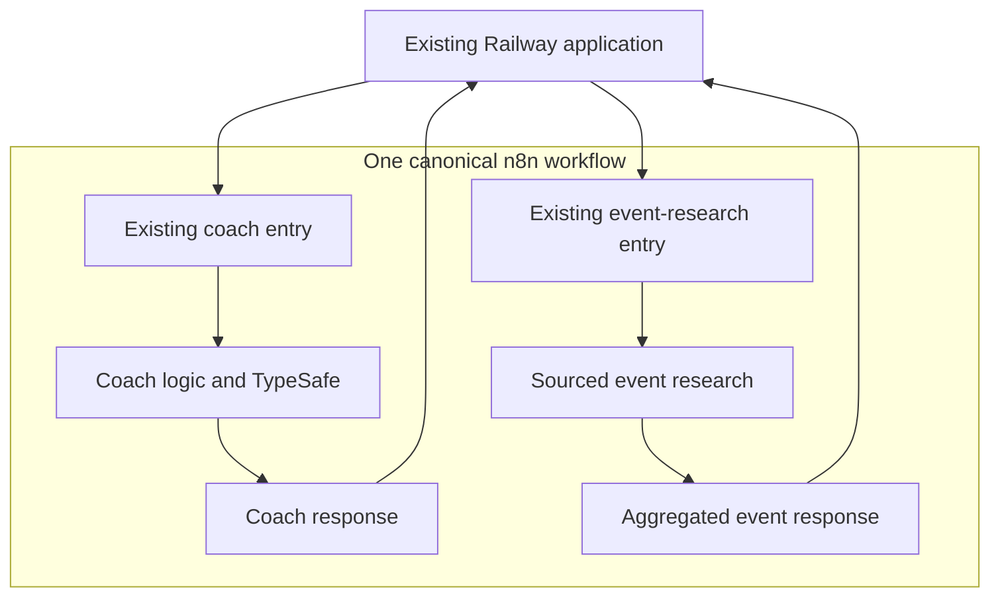

# Flow4Gold — Addendum 05: One n8n workflow

Prepared 30 September 2026, America/New_York  
System: **The Economics of Everything — The concert**  
Website: https://web-production-af12a.up.railway.app/

## 1. Decision and scope

Consolidate the two identified n8n workflows into **one canonical, active workflow containing the concert system’s existing coaching and event-research logic**. Reuse one existing workflow ID. Retire the other as an inactive, clearly labeled rollback copy after a successful cutover.

This explicitly overrides the recommendation in Addendum 04 to keep the coach and event research in separate workflows. Earlier instructions about the approved concert, dashboard, financial calculations, city/date research, voice, and TypeSafe remain in force.

The user says the system looks great. **Do not redesign the website, dashboard, Blender assets, concert, DJ, audience, lights, or neon signs.** This is an integration consolidation, not a new visual or feature build. **The official native TypeSafe AI node is a mandatory, connected, operational part of the final workflow.**

### Exact workflows to inspect

| Workflow ID | URL | Current role |
|---|---|---|
| `Cbr6Bvxj4vKROEaE` | https://amdrfound.app.n8n.cloud/workflow/Cbr6Bvxj4vKROEaE | Inspect; do not infer from ID/order. |
| `Hdc8JHwuai8BlbI6` | https://amdrfound.app.n8n.cloud/workflow/Hdc8JHwuai8BlbI6 | Inspect; do not infer from ID/order. |

The private canvases have not been inspected in this document-writing session. Their actual nodes, roles, credentials, publication state, and callers must be discovered in the implementing Codex environment. The intended coaching/research split comes from the prior specification, not from a verified inspection of these IDs.

## 2. Simplest target design

**One workflow does not require one webhook or one serial chain.** Prefer moving both existing entry branches onto one canvas while preserving their working request/response contracts and external webhook paths where feasible.

Use a clear canonical name, such as **The Economics of Everything — Concert System**. Arrange two labeled sections:

- **Concert coach:** existing question/voice entry → existing validation/TypeSafe/explanation logic → existing response.
- **City & date research:** existing research entry → existing sourced retrieval, normalization, and classification → aggregated research response.

Each incoming request executes only its applicable branch. A normal coaching question must not automatically launch event searches. An event search must not automatically launch narration. Carry existing researched context into coaching through the application’s current trusted context mechanism.

This diagram is the intended arrangement, not a representation of the current canvases. Preserve additional legitimate entry points if inspection finds voice or other existing functions use them. Do not drop working behavior to force the diagram’s exact node count.

If the app already uses a single action-based endpoint, keep that pattern: one webhook plus an allowlisted action Switch may be simpler. Do not add a dispatcher, new response envelope, gateway service, queue, subworkflow hierarchy, or third production workflow solely to make the consolidation look more unified. Do not use AI to route an action the application already identifies deterministically.

Do not link the two old workflows with Execute Sub-workflow and call that consolidation. The goal is one maintained production canvas, not one wrapper that still depends on both originals. Nor should one branch call a webhook in the same workflow to simulate an internal function call.

A small amount of branch-local validation or response logic is acceptable when sharing it would introduce brittle cross-branch dependencies. Retain separate response nodes when contracts differ. Keep provider nodes and credentials that already work; optimize demonstrated duplication only.

### Preserve the existing QR-code entry point

**The existing QR code must continue to work after consolidation, including copies already shared or printed.** Preserve the QR image, the exact encoded public URL, its route/redirect behavior, and any relevant query parameters such as lesson or language. Do not generate a replacement QR code or require users to rescan a newly issued code as a consequence of this migration.

Inspect the actual QR asset or configuration and decode its destination. Do not assume it contains the site root, a lesson URL, a short link, or an n8n webhook. If it opens the website, retain that landing flow and update only the backend workflow connections as needed. Opening the page does not itself imply an n8n execution: preserve the existing timing of the user action that starts coaching or research. If the QR currently points directly to a webhook or redirect, preserve that exact public entry path and behavior during cutover, bringing the required logic into the canonical workflow or existing app as appropriate. Do not leave a second active compatibility workflow solely for the QR.

Acceptance: decode and verify the existing QR destination, scan the ORIGINAL QR on a phone when available, confirm the expected concert page/entry experience and language, then perform a coaching request and a city/date search and trace them to the canonical workflow. Check already distributed links, not only a newly rendered QR image. If only URL navigation or viewport emulation was tested, label the physical scan test pending; do not claim a real device scan occurred.

## 3. Inspect, choose, and preserve

1. Read repository instructions; inspect Git changes and existing workflow exports. Preserve unrelated and uncommitted work.
2. Fetch both real workflow definitions through authorized n8n access. Compare saved canvas and published/active versions. Inspect recent executions to determine what the live application actually calls.
3. Trace the website’s server routes, including the current coach and event routes, through environment-variable names to each production webhook. Verify request method/path, authentication, response mode, content type, payload shape, and any other callers. Never print credential values.
4. Record every existing trigger, relevant branch, integration, TypeSafe node, credential reference, workflow setting, error workflow reference, pinned data, and persistence/cache dependency. Check for workflow-ID-dependent static data, callback URLs, tags, and expression references.
5. Export both definitions before editing and checkpoint the application. Keep credential references needed for import, but remove secret values and private execution/pinned sample content from shared artifacts.
6. Choose one existing ID as canonical based on actual production use and least migration risk. Prefer the established primary concert workflow if evidence supports that choice; do not automatically select the first URL. Record the reason in one sentence.
7. Rename the chosen workflow clearly. Move the other workflow’s necessary nodes and connections into it. Resolve duplicate node names/IDs deliberately and repair affected expressions, item linking, and references to old trigger names.

Do not assume workflow-level settings migrate with copied nodes. Reconcile time zone, timeout, execution order, execution-data retention, and error behavior intentionally. If the branches need different behavior, implement the narrow branch-specific setting without broad infrastructure changes.

## 4. Preserve behavior and contracts

- Keep the current browser/ server endpoints and payload formats unless a specific incompatibility requires a small change. Two server environment variables pointing to two webhook paths in the same workflow are not duplication that needs removal.
- Keep authentication at every entry. Do not weaken an endpoint because another branch used a different credential. Reuse authorized existing credentials.
- Preserve requestId, language, economic scenario revision, planning revision, city/time-zone/date fields, source metadata, and error/status fields through data transformations.
- Ensure copied expressions reference executed nodes in the current branch. A coach execution cannot safely assume the event trigger also ran, and vice versa. Carry required context forward in the item rather than reaching across unrelated trigger paths.
- Do not use a Merge node that waits for both independent webhook branches. They are separate executions, not parallel inputs to one request.
- Return one appropriate response for each request. Keep branch-specific response nodes if simplest. Aggregate event items into one object containing an events array; explicitly handle zero events and failures.
- Preserve the native TypeSafe AI integration and its actual role. Do not remove it merely to reduce node count, or run it on unrelated requests. Keep deterministic dates/calculations outside AI decision making.
- Preserve sourced event results, coverage/freshness labels, uncertain classifications, voice responses, and existing English/German behavior.
- Keep the local financial simulation fast and independent. Sliders, crowd changes, neon metrics, and the turntable’s visual animation do not need new n8n calls.
- Preserve cache/persistence when moving branches; workflow-local cache/static data must not silently disappear or be treated as a new live source check.
- Never fabricate events or report all integrations as working when one has a missing credential. Retain existing prepared/partial/unavailable responses.

### Mandatory TypeSafe AI integration

The final canonical canvas must contain the actual official **TypeSafe AI** node, connected to a real execution path. Retain and verify an existing working node; if absent or incomplete, install/configure the supported official integration in the existing n8n Cloud account and add it. Verify the official package `@typesafe-ai/n8n-nodes-typesafe-ai`, its installed schema/version, and account availability against the vendor repository and n8n listing. Do not guess node type identifiers or import fields.

Use a narrow, useful task: classify the learner’s concert question using the node’s Evaluate operation, then route its structured result with deterministic n8n logic to the appropriate existing explanation context. Suggested intents: ticket price, audience/capacity, costs, profit/ROI, city/date/event context, comparison, and unclear/other. Keep confidence/uncertainty handling and an explicit clarification or prepared-answer path. Use the actual documented output schema. Reuse an existing equivalent TypeSafe decision if it already works rather than rebuilding it.

The application already distinguishes coach requests from event requests; use that known request type or the existing webhook entry to select the branch. Do not pay TypeSafe to rediscover the endpoint’s identity. TypeSafe instead interprets the ambiguous natural-language question within the coach branch. Preserve any useful existing sourced-event relevance classification, but avoid duplicate calls solely to make both branches contain the same node. Reuse the existing credential across legitimate TypeSafe nodes.

Do not use TypeSafe for revenue, ROI, dates, or arithmetic, and do not let its classifications alter attendance automatically. A disconnected logo, disabled node, sticky note, mocked result, or HTTP Request substitute is not completion of the native-node requirement. Do not remove or bypass the node merely to achieve a smaller canvas.

If an account credential or Cloud-node availability blocks activation, finish the other work and mark **TypeSafe integration incomplete** with the exact setup needed. Do not claim the system is complete. Keep API keys in n8n credentials, and use the existing account where available.

Acceptance requires at least one real coaching execution through the native TypeSafe AI node with a valid structured result and downstream handling. Also exercise low-confidence/unclear and provider-failure handling; distinguish deliberate test fixtures from live provider responses. Record the workflow/execution IDs and node version without exposing credentials or private prompt data.

Official references for implementation:
- https://github.com/typesafe-ai/n8n-nodes-typesafe-ai
- https://n8n.io/integrations/typesafe-ai/
- https://docs.typesafe.ai/introduction

## 5. Test without breaking production

Build and inspect the consolidated draft first. Test each entry separately using supported test facilities, without changing active production webhook ownership prematurely. Remove reliance on pinned fake results in integration proof.

If canonical draft updates are auto-saved, verify which version is actually executing in production. A saved draft is not proof that the published workflow changed. Capture the last known working versions before publishing.

n8n permits only one registered webhook for a given path plus HTTP method. It also distinguishes test and production webhooks. Do not publish the same production method/path simultaneously in the old and consolidated workflow. [S1]

### Preferred cutover: preserve existing webhook paths

1. Complete the draft and tests, export it, and prepare a rollback procedure before taking a live endpoint down.
2. Confirm which paths remain in the canonical workflow and which must move from the retiring workflow. Preserve unique webhook identifiers where supported, or record necessary changes; do not assume URLs from workflow IDs.
3. Check in-flight work and any non-app callers. At cutover, unpublish/deactivate the retiring workflow as required to release conflicting webhook registrations, then promptly publish/activate the tested canonical version. Follow the installed n8n version’s terminology and supported API/UI.
4. Verify actual production URL registration and authentication for every branch. Keep Railway settings unchanged when verified production URLs remain identical. If any changed, update only the affected server-side settings and deploy the compatible application.
5. Run live, uncached requests through the website and confirm both operations now appear under the same canonical workflow ID. If the cutover fails, restore old registration ownership and app configuration immediately using the saved versions. Do not promise a zero-interruption cutover when the same URL must transfer ownership.

### If preserving a path is not feasible

Use a new unique path for only the moved entry in the canonical workflow; publish/test it, update the corresponding Railway server setting, then drain and disable the old workflow after verifying that no caller remains. This is still one final active workflow. A short migration overlap is acceptable; do not leave two active systems after completion.

Select the least disruptive of these approaches based on the actual endpoints and permissions. Do not add permanent compatibility proxy workflows. Do not disable an unrelated caller without migrating it or reporting the specific conflict first.

## 6. Retire the duplicate reversibly

After successful cutover:

- Exactly one of the two supplied workflow IDs is the active, canonical concert system.
- The other is inactive/unpublished and renamed, for example **ARCHIVED — Replaced by Concert System — 2026-09-30**. Use n8n’s recoverable archive facility if available and appropriate, or a clearly labeled inactive backup. Keep it out of the active working view.
- Add a note pointing to the canonical workflow and purpose of the backup. Retaining a rollback copy does not mean maintaining two active systems.
- Remove obsolete active workflow references from the application, deployment config, current setup instructions, and maintained workflow exports. Historical backups can remain explicitly labeled.
- Do not permanently delete the old workflow or its execution history as part of this consolidation.

Do not deactivate the retired workflow “only after testing” in a way that conflicts with section 5: a path-preserving cutover may require deactivation immediately before activating the canonical workflow. Test the draft first, conduct the coordinated transition, then verify production and finish retirement. Roll back if verification fails.

## 7. Acceptance and proof

| Check | Required result |
|---|---|
| Existing QR code | Original shared/printed QR destination and entry behavior remain valid; scan-to-page-to-canonical-workflow flow is checked. |
| One system | One named canonical active workflow, reusing one supplied ID. |
| Clear canvas | Coach and research areas are labeled and readable without nested workflow indirection. |
| Coaching | A question from the live website produces the expected response through the canonical ID. |
| Event research | A live uncached city/date check executes through the same ID and returns sourced results or a truthful availability status. |
| Correct routing | Coaching does not trigger unnecessary searches; research does not trigger unnecessary coaching/audio. |
| Native TypeSafe AI | A connected official native node executes successfully in the canonical workflow; structured output drives a real decision, with uncertainty/error paths. |
| Voice and languages | Existing supported voice/text and language paths remain functional. |
| Errors | Invalid input, provider failure, zero events, and TypeSafe uncertainty/failure preserve valid response semantics. |
| Parallel visitors | Concurrent coach and research requests do not mix state or wait for one another’s trigger. |
| Data integrity | Request IDs, scenario/query identity, city/date/time-zone values, and source metadata survive migration. |
| No UI regression | Approved concert, turntable dashboard, numeric levers, crowd response, ROI, and save/undo are unchanged. |
| Retirement | Old workflow has no remaining production callers and is clearly inactive/archived. |
| Honest completion | Canvas update, publication, Railway configuration/deployment, and live tests are reported separately. |

Deliver a small before/after mapping: old workflow ID and endpoint → canonical workflow ID and endpoint; only actual discovered URLs, with no secrets. Include node changes, workflow settings reconciled, real execution IDs/request IDs for one coach and one uncached research test, and rollback steps. Distinguish fixture/mock checks from real calls and cache hits from actual searches.

Completion is not just a merged JSON export or a screenshot of two node groups. It includes the actual n8n canvas, production webhook ownership, application configuration, and end-to-end behavior.

## 8. Access limitations

Use the existing authorized n8n connection/API/UI and Railway project. Do not create accounts, another hosting service, another production workflow, or another orchestration layer.

If the implementing environment cannot access the two canvases, inspect repository exports and prepare a consolidated import artifact and precise instructions as far as verified data permits. Do not invent missing workflow content. Request only the specific access/export needed, without asking for secrets in chat. Continue useful unblocked work and explicitly mark live migration as pending.

This brief authorizes the consolidation implementation within the user’s existing project, subject to the executing environment’s permissions. It does not override permission controls or grant access that is absent. Follow the existing release process; do not report unpublished/local work as a live change.

## 9. Technical references

- [S1] n8n Webhook common issues: uniqueness of registered method/path pairs and test/production distinctions. https://docs.n8n.io/integrations/builtin/core-nodes/n8n-nodes-base.webhook/common-issues
- n8n Webhook configuration: https://docs.n8n.io/integrations/builtin/core-nodes/n8n-nodes-base.webhook
- n8n Respond to Webhook: https://docs.n8n.io/integrations/builtin/core-nodes/n8n-nodes-base.respondtowebhook
- n8n mapping references, useful when node names change: https://docs.n8n.io/data/data-mapping/data-mapping-ui/

These support integration mechanics; they do not establish the contents of the user’s private workflows. Verify installed-version behavior during implementation.

## 10. Full Codex prompt

Place this file beside the earlier Flow4Gold briefs. The following prompt is also provided separately as `Flow4Gold_Addendum_05_Codex_Prompt.md`.

<!-- CODEX_PROMPT_START -->
Read `Flow4Gold_Addendum_05_One_n8n_Workflow.md` and consolidate the existing concert system into ONE active n8n workflow. This overrides Addendum 04’s recommendation to maintain separate coach and event-research workflows. The website looks great; preserve its approved concert scene, Blender assets, turntable dashboard, calculations, controls, and behavior.

Website: https://web-production-af12a.up.railway.app/

**Preserve the existing QR-code trigger/entry point.** Inspect and decode its actual destination; retain the original QR image, encoded URL, route/redirect, lesson/language parameters, and behavior so already printed/shared codes keep working. Do not replace the QR code. If it opens the website, keep that flow and change only the backend connections. If it targets an n8n webhook, preserve that public path through the coordinated migration without leaving a second active workflow. Retain the existing timing of workflow calls; scanning/opening a page must not add unwanted paid searches. Test the original QR on a phone when available, confirm the expected page, and trace subsequent coaching and event research into the canonical workflow. Clearly distinguish a real scan from a URL-only test.

Inspect BOTH actual workflows before choosing the canonical one:
- https://amdrfound.app.n8n.cloud/workflow/Cbr6Bvxj4vKROEaE
- https://amdrfound.app.n8n.cloud/workflow/Hdc8JHwuai8BlbI6

Do not guess which ID does what. Read repository instructions, preserve existing uncommitted work, fetch the current saved/published definitions, inspect recent executions, and trace the Railway server endpoints/environment-variable names to their actual production webhook URLs. Check other callers before retiring anything. Export recoverable backups without secret values.

Reuse ONE of those existing workflow IDs, selecting the one that minimizes disruption based on actual production use. Name it “The Economics of Everything — Concert System.” Move all necessary logic from the other workflow into clearly labeled Coach and City & Date Research areas on that canvas. Do not create a third production workflow, a wrapper calling the old workflows, or a subworkflow hierarchy.

Prefer retaining the existing webhook entry points and request/response contracts inside this one workflow. One canvas can have separate entry branches; do not force an unrelated API redesign. If a single action-based entry already exists and is clearly simpler, preserve it with deterministic routing. No new AI dispatcher, queue, gateway, or self-calling webhook. A coach request should run only its appropriate branch; an event search should run only the research branch.

The official native TypeSafe AI node is MANDATORY. Retain and verify it if already working; add/configure it if missing. Verify the official package `@typesafe-ai/n8n-nodes-typesafe-ai`, installed schema/version, credentials, and account availability. Connect it to a real decision path: use Evaluate for concert-question intent, with deterministic downstream branching and explicit uncertainty/error handling. Do not use it merely to route the app’s already-known request type. A disabled/disconnected node, mock, sticky note, or HTTP substitute does not satisfy this requirement. Demonstrate at least one real successful execution through the native node. If activation is blocked, mark TypeSafe incomplete with the specific missing setup. Preserve current provider credentials, coaching/voice/language behavior, sourced city/date research, cache/freshness semantics, and error handling. Keep arithmetic local/deterministic and do not add n8n calls to sliders or animations. Keep small branch-specific validation/response nodes if sharing them adds complexity.

Repair copied node IDs/names, expressions, item linking, trigger references, and workflow-level settings. Carry requestId, scenario/planning revision, query identity, city/date/time-zone data, language, and source metadata through each branch. Do not reference an independent trigger that did not run. Do not use a Merge node that waits for both separate webhook requests. Return one correct response per request, including zero-event and error cases.

Prepare and test the consolidated draft BEFORE changing production registrations. n8n allows only one registered webhook per HTTP method/path pair. If preserving the old paths, coordinate releasing the retiring workflow’s registration and publishing the canonical workflow; prepare rollback first and verify promptly. Do not try to publish conflicting endpoints simultaneously. If a small server-side URL change avoids a risky path transfer, use a unique path in the canonical workflow, test it, switch the corresponding Railway setting, then disable the old workflow. Keep the deployed app compatible during cutover.

Update the ACTUAL n8n canvas and production configuration, not just a local JSON file. Verify the published/active version, credentials, response modes, webhook ownership, and Railway settings. Follow the existing release process and permissions. After migration, run one real coaching request and one real uncached city/date search from the website; trace both to executions under the SAME canonical workflow ID. Verify concurrency and failure paths without cross-request state leakage. Confirm the UI and financial outputs remain unchanged.

Finish with exactly one canonical active workflow. Unpublish/deactivate and clearly rename/archive the retired workflow as a rollback backup once the cutover is verified; do not permanently delete it. Ensure no production callers still use it. Update current setup documentation and maintained workflow exports so future revisions target the canonical ID.

Deliver the final canonical workflow URL/ID, the retired workflow’s status, a concise before/after endpoint mapping, sanitized consolidated export, actual node/settings changes, real test execution IDs/request IDs, and rollback instructions. Distinguish local edits, canvas update, publication, Railway change, and live verification. A merged export alone is not completion.

If n8n access is unavailable, complete the work possible from verified repository exports, clearly mark the live migration pending, and specify only the missing access/export needed. Do not invent node content or successful executions. Keep this consolidation small and practical; no additional features or visual redesign.
<!-- CODEX_PROMPT_END -->
