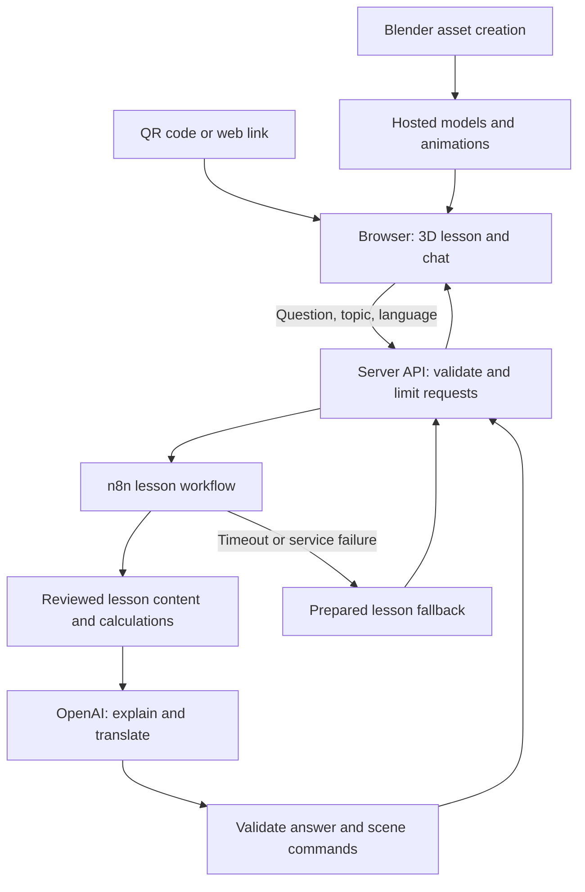

# The Economics of Everything — Flow4Gold build brief

Prepared September 29, 2026. Status: proposed architecture and implementation handoff. No application, connected workflow, or deployed demonstration has been built as part of this brief.

## Product intent

A learner scans a QR code or opens a link, asks an everyday economics question, and explores a short interactive 3D lesson on a phone or desktop browser. The learner remains themselves. Roleplay, quizzes, narration, and deeper interaction are optional. The experience should be memorable, multilingual, and useful after a two-minute visit.

Keep three topic directions: music and DJ events; conferences and communities; factories and supply chains. Recommended first complete scene: a miniature concert venue demonstrating ticket revenue, costs, and profit. Additional topics are future scope until working; do not present unfinished lessons as available.

## Where to build

Use one Git repository as the source of truth. Recommended primary workspace: VS Code with the Codex extension, alongside a local Blender installation and browser preview. Codex CLI is an alternative interface to that same project. Codex Cloud can handle bounded repository tasks after its environment is configured, but local Blender availability should not be assumed in a cloud environment. This conversation can support specifications, code drafts, and reviews; the local project provides a direct route to running Blender and inspecting the actual scene.

Codex is the development assistant. OpenAI API models are the proposed runtime tutor. Blender authors assets. Babylon.js renders and animates the browser scene. n8n coordinates lesson requests and responses. These are distinct responsibilities.

## Architecture schematic

The QR code opens the website. The server request caused by a topic selection or question triggers n8n. Browser animation and camera movement stay in the browser; they should not make workflow or model calls every frame. Blender runs during asset production, not once per visitor.

## Component responsibilities

| Component | Responsibility |
| --- | --- |
| Browser interface | Touch and mouse navigation, accessible controls, language selection, chat, 3D display, visible assumptions |
| Blender | Original scene, optimized meshes, materials and reusable animation clips; export assets compatible with the browser renderer |
| Babylon.js | Load assets, animate the venue, highlight objects, update visual states and handle user interactions |
| Server API | Keep secrets server-side, validate input, restrict request volume, pass requests to n8n |
| n8n | Route topic and language, retrieve approved content, invoke calculations and model, validate output, deliver fallback, record operational metrics |
| OpenAI model | Explain reviewed concepts and computed outcomes in the requested language; return structured content |
| Calculation module | Deterministic economics formulas and scenario constraints shared with the interface |
| Hosting | Serve the website, models and server endpoint over HTTPS; provider remains unselected |

Do not add Hugging Face or other model platforms unless a specific need justifies another dependency. Confirm existing accounts before creating new ones.

## First lesson: the economics of a live music event

The opening view shows a small 3D stage, entrance and stylized audience. The learner can tap the entrance for revenue, the stage for fixed costs, and the audience for variable costs. A ticket-price control changes the hypothetical attendance estimate and computed result. Show assumptions alongside the result so it cannot be mistaken for an actual forecast.

Illustrative teaching model only:

- Capacity: 200 attendees.
- Fixed costs: 1,500 currency units.
- Variable cost: 5 per attendee.
- Ticket price p: restricted to 5–50.
- Attendance q(p): min(200, max(0, 250 − 5p)). Fractional attendance is rounded down consistently.
- Revenue: p × q.
- Total cost: 1,500 + 5 × q.
- Profit: revenue − total cost.
- Event return on cost: profit / total cost × 100; identify this definition explicitly.

At p = 20: attendance 150, revenue 3,000, cost 2,250, profit 750, return on cost approximately 33.3%. At p = 30: attendance 100, revenue 3,000, cost 2,000, profit 1,000, return on cost 50%. These invented examples illustrate how unchanged revenue can accompany different profit. No claim of optimal pricing or real demand is made.

The same calculation module drives labels, audience counts and model explanations. The model must not invent replacement numbers. For simplicity, crowd figures may represent groups of attendees if clearly labeled.

## Proposed workflow contract

Input fields: requestId, sessionId, topicId, language, question and bounded scenario parameters. Collect no name or email by default.

Output fields: lessonId, language, explanation, calculationResults, assumptions, sceneActions, suggestedFollowup, sourceReferences and fallbackUsed.

Scene actions must come from a small allowlist such as highlightEntrance, highlightStage, setAudienceCount and showProfit. Never execute arbitrary model-generated JavaScript or Blender Python from a visitor request.

Proposed n8n sequence: authenticated webhook → input validation → topic routing → approved content and deterministic calculation → OpenAI explanation → schema and numeric consistency checks → response. Validation failures return a useful correction; model or service failures return prepared content. Verify exact node configuration against the installed n8n version when implementing.

## Mobile and multilingual requirements

Use a lightweight scene with readable labels, simple touch controls, a loading indication, and a way to skip animation. Start with two reviewed languages, provisionally English and German; retain a structure that supports adding languages. Keep text outside baked textures so translation does not require rebuilding the scene. Narration is optional and user-initiated; captions and text must remain usable in a noisy conference.

Provide a clear 2D explanation if 3D cannot load or the device cannot run it smoothly. Test at least one actual phone and one desktop browser; browser emulation alone does not establish mobile performance. Pause unnecessary rendering when the page is hidden.

## ROI and evidence

Separate the lesson's simulated event return from the platform's business value. Measure actual production time, translation/review time, API cost per completed session, completion rate and optional evidence of learning. A business ROI estimate needs a real baseline and defined benefits; do not claim savings before collecting evidence.

Proposed platform ROI calculation: (measured benefit − total cost) / total cost. Benefits and costs must share a time period. Include development, hosting, API use, maintenance and human review. A before/after learning question provides a preliminary signal, not proof of long-term retention or causal improvement.

## Build order and completion gates

1. Confirm local workspace, Blender availability, existing n8n access and runtime API access. Keep credentials out of the repository and submission.
2. Establish one attractive Blender scene and a short motion sample. Review mobile label readability before expanding the environment.
3. Build browser interaction with deterministic calculations and prepared lesson text. Confirm the scene works without the model.
4. Connect the server and n8n workflow, add explanation and language handling, and exercise failure paths.
5. Verify one complete learner journey on phone and desktop. Check numeric consistency, both languages, invalid input, model timeout and failed 3D loading.
6. Record the entry demonstration and export a sanitized workflow JSON, screenshot and setup instructions.

Do not expand to all three environments until the first journey passes. The initial scope is a recommendation, not a guarantee of delivery within the deadline.

## Submission constraints from supplied terms

The two uploaded reference files contain the Flow4Gold terms dated September 10, 2026. Section 3.1 gives October 1, 2026, 23:59 CEST as the submission deadline, equivalent to October 1, 17:59 in Atlanta. This brief uses those supplied terms; no later amendment has been verified.

Section 4.1 requests workflow JSON or an unpublished creator-template ID, a publicly accessible video of about two minutes introducing the entrant and showing the workflow, and a workflow screenshot. Document required external components so judges can understand and reproduce the n8n workflow. Section 5.3 emphasizes usability, completeness, error handling, result quality and the problem solved. Use synthetic data and remove credentials from the submission. The rules also require a valid conference ticket at registration and an entrant-created, unpublished workflow; review the original eligibility conditions before entry.

## Handoff instruction for Codex

Implement this brief in one repository. Begin by checking the existing project, installed tools and AGENTS.md instructions. Preserve the agreed interactive 3D experience. Use a single concert lesson first, authored in Blender and rendered in the browser with Babylon.js. Keep the learner as themselves, make deeper interaction optional, and separate deterministic economics from AI explanation. First produce a locally runnable scene and calculation module; then connect the n8n workflow and model. Confirm existing accounts before provisioning services. Keep secrets server-side. Report completed work separately from proposed or blocked work. Do not claim a live integration, mobile validation, or deployment until verified.

## References

- OpenAI Codex IDE documentation: https://learn.chatgpt.com/docs/codex/ide
- OpenAI Codex CLI documentation: https://learn.chatgpt.com/docs/codex/cli
- OpenAI Codex Cloud documentation: https://learn.chatgpt.com/docs/cloud
- n8n webhook documentation: https://docs.n8n.io/integrations/builtin/core-nodes/n8n-nodes-base.webhook/
- Creator's explanation linking the supplied video: https://www.linkedin.com/posts/mkashef_youve-probably-seen-the-shiny-demos-of-video-activity-7505282745841930240-CdG1
- Supplied video reference: https://youtu.be/27qpBfBhpDk (not directly viewed).
- Competition evidence: supplied Pasted markdown.md and Pasted markdown (2).md, sections 2–5.
