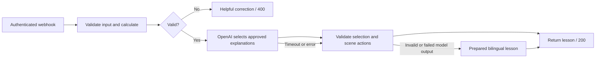

# The Economics of Everything

A two-minute economics lesson you can explore in a miniature concert venue. Change the ticket price, see the audience change, and discover why identical revenue can produce different profit.

The original Blender scene, Babylon.js browser application, Node gateway, and n8n workflow live in this repository. The only available lesson is **The Concert**, in English and German. No account or personal information is required from learners.

**Live demo:** https://web-production-af12a.up.railway.app. QR code: `docs/demo-qr.svg`. Source repository is private during competition preparation.

## Run locally

Requires Node 22 or newer. Blender is only needed to rebuild the model.

```powershell
npm ci
npm run dev
```

Open http://localhost:3000. With no webhook configuration, the complete interactive lesson runs with prepared explanations. This is visibly labeled; it does not pretend to have used AI.

For a production build:

```powershell
npm run build
npm start
```

## Connect n8n

1. Import `workflow/economics-concert.json` into n8n.
2. On **Lesson request**, select a **Header Auth** credential. Set its header name to `X-Lesson-Key` and use a long random secret as its value.
3. On **Explain the concert**, select an **OpenAI** credential containing your own API key. The default model is `gpt-4o-mini`; the HTTP request uses the Responses API with a strict schema and `store:false`.
4. Publish the workflow. Copy its production webhook URL.
5. Add `N8N_WEBHOOK_URL` and the matching `N8N_WEBHOOK_SECRET` to the app server's environment. Restart the app. The browser never receives these secrets.
6. Ask a concert economics question. The lesson card identifies whether n8n/OpenAI or prepared content supplied the explanation.

No community nodes, database, external asset service, or vector store are required. The n8n workflow can also be called without the browser using the contract below.

The project owner's instance is configured by `scripts/n8n-deploy.js`. That helper is intentionally tied to their existing empty workflow and is **not** the generic installation route. It creates credentials securely using the API, then writes only connection details into the ignored local `.env`. The downloadable workflow contains no credential identifiers or values.

## What n8n does



The workflow is the runtime lesson orchestrator: authentication, validation, topic/language restriction, deterministic economics, contextual content selection, output validation, and graceful model fallback. Client-side camera movement and the price slider do not make model calls. Only an explicit question triggers the lesson API.

## Why the AI cannot change the economics

`shared/lesson.js` contains the single calculation implementation and authored bilingual content. `npm run workflow` embeds those exact functions in n8n Code nodes. The model selects one to three approved paragraph IDs and a scene focus; it cannot write replacement facts, prices, figures, source links, or JavaScript. The server and browser independently recheck returned calculations.

This constrained tutor trades open-ended generated prose for consistent, auditable explanations within one lesson. It is not a general economics chatbot. The English and German text has been reviewed during implementation; a native German human review is still recommended before final recording.

Attendance is `floor(min(200, max(0, 250 − 5 × price)))`, with price restricted to 5–50 and rounded to cents. Fixed costs are 1,500, variable cost is 5 per attendee, and return on cost means profit divided by total cost, times 100. All money is in illustrative currency units.

| Ticket price | Guests | Revenue | Total cost | Profit | Return on cost |
| --- | ---: | ---: | ---: | ---: | ---: |
| 20 | 150 | 3,000 | 2,250 | 750 | 33.3% |
| 30 | 100 | 3,000 | 2,000 | 1,000 | 50% |

These are invented teaching assumptions, not forecasts or price recommendations. Platform business ROI has not been measured.

## Request / response

Send JSON to the app's `/api/lesson` route, or to the authenticated n8n webhook:

```json
{
  "requestId": "synthetic-request-001",
  "sessionId": "synthetic-session-001",
  "topicId": "concert",
  "language": "en",
  "question": "Why is a full house not always more profitable?",
  "scenario": { "ticketPrice": 30 }
}
```

The response contains `lessonId`, `language`, `explanation`, `calculationResults`, `assumptions`, `sceneActions`, `suggestedFollowup`, `sourceReferences`, `fallbackUsed`, and `delivery`. Allowed scene actions: `highlightEntrance`, `highlightStage`, `setAudienceCount`, `showProfit`. They describe UI intent and never contain executable code.

## Failure behavior

| Situation | Result |
| --- | --- |
| Invalid input or unsupported topic/language | HTTP 400 with a correction |
| Missing/wrong webhook authentication | n8n rejects before running the workflow |
| OpenAI error, refusal, timeout, malformed output, unknown content ID | Prepared lesson in the chosen language |
| n8n unavailable or inconsistent numbers | Gateway supplies a prepared lesson |
| Browser network failure | Browser supplies a prepared lesson |
| Model unavailable | Price slider, calculations, 3D venue, quiz still work |
| GLB fails or WebGL unavailable | 2D audience and revenue/cost chart |
| Question returns after price/language changes | Stale response is discarded |
| More than 12 questions per IP per minute | HTTP 429 |
| 300 upstream calls per day per server process | Prepared content until the UTC day changes |

The demo limiter is in memory. Run one replica. A production rollout with multiple replicas needs a shared rate/budget store. A restart resets the per-process cap; also set an account budget at the model provider. Do not expose n8n API keys through this app.

Application logs contain only language, delivery mode, fallback status, and duration. They do not record questions, session IDs, or IPs. n8n execution payload saving is disabled in this workflow. Hosting/network providers may retain their own access logs. Questions reach OpenAI when AI selection is enabled; the UI asks learners not to include personal information.

## Rebuild the original scene

```powershell
& 'C:\Users\amdre\blender-4.3.2-windows-x64\blender.exe' --background --python scripts/create-venue.py
```

The editable source is `assets/concert.blend`; its reproducible authoring script is `scripts/create-venue.py`. The browser loads `public/models/concert.glb`. Each crowd figure represents up to five attendees. The venue uses original geometric assets rather than third-party models. Fonts are bundled locally with their package licenses.

## Verify

```powershell
npm test
npm run test:browser
node --env-file=.env scripts/check-live.js
```

Browser checks require Playwright Chromium (`npx playwright install chromium` if needed) and the app running on port 3000. Tests cover formula boundaries and identities, schema and model failure cases, desktop and mobile viewport journeys, both languages, and failed 3D loading. Viewport emulation is not a substitute for an actual phone test.

## Deployment and submission

See [the setup walkthrough](docs/MANUAL-STEPS.md), [submission checklist](docs/SUBMISSION.md), and [validation record](docs/VALIDATION.md). Railway can build the included Dockerfile and checks `/api/health`. The submission video is deliberately the last production step.

Implementation references: [n8n Webhook](https://docs.n8n.io/integrations/builtin/core-nodes/n8n-nodes-base.webhook/), [OpenAI Structured Outputs](https://developers.openai.com/api/docs/guides/structured-outputs), [Babylon.js loading](https://doc.babylonjs.com/features/featuresDeepDive/importers/loadingFileTypes/).
